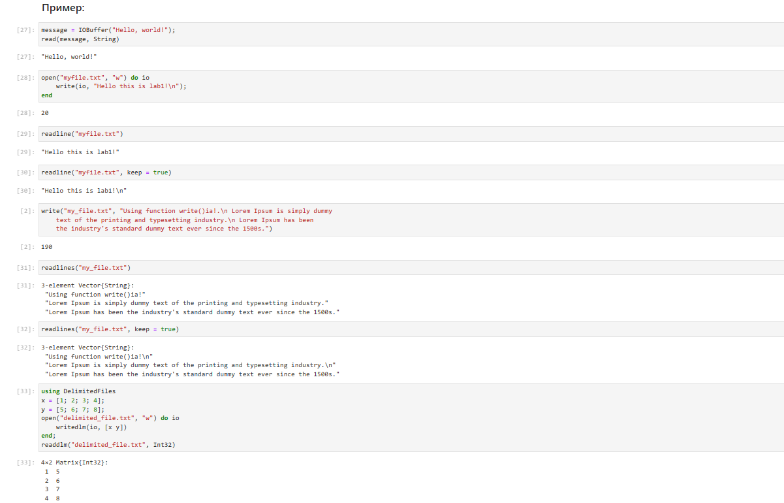
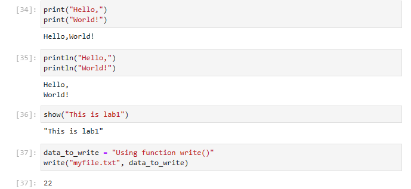
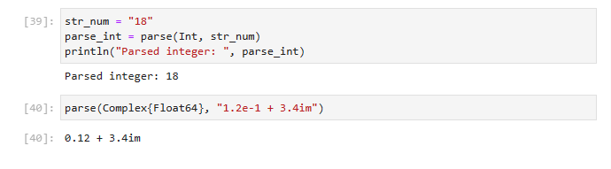
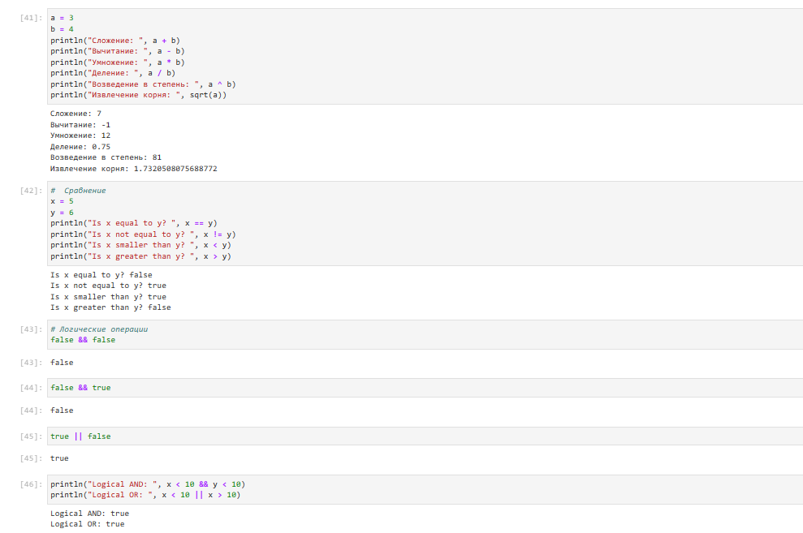
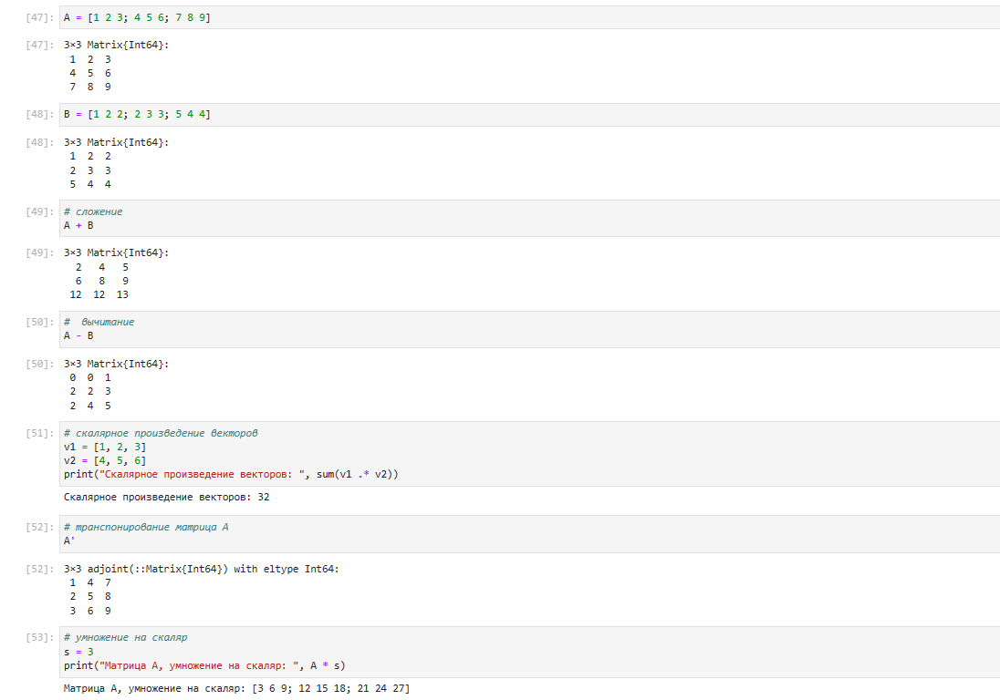

---
## Front matter
lang: ru-RU
title: Лабораторная работа №1
subtitle:  Julia. Установка и настройка. Основные принципы.
author: |
	 Ким Реачна\inst{1}

institute: |
	\inst{1}Российский Университет Дружбы Народов

date: 10 ноября, 2023, Москва, Россия

## Formatting
mainfont: PT Serif
romanfont: PT Serif
sansfont: PT Sans
monofont: PT Mono
toc: false
slide_level: 2
theme: metropolis
header-includes: 
 - \metroset{progressbar=frametitle,sectionpage=progressbar,numbering=fraction}
 - '\makeatletter'
 - '\beamer@ignorenonframefalse'
 - '\makeatother'
aspectratio: 43
section-titles: true

---
# Цели и задачи

## Цель лабораторной работы

Подготовить рабочее пространство и инструментарий для работы с языком программирования Julia, на простейших примерах познакомиться с основами синтаксиса Julia.

## Задание

1. Установите под свою операционную систему Julia, Jupyter.
2. Используя Jupyter Lab, повторите примеры.
3. Выполните задания для самостоятельной работы.

# Процесс выполнения лабораторной работы

## Основные функции Julia

- read(): функция read() используется для чтения данных из стандартного ввода (клавиатуры) или из файла.
- readline():  функция читает строку из стандартного ввода или файла. 
- readlines(): считывание всех строк из файла или потока ввода-вывода. 
- readdlm(): используется для чтения данных из текстового файла, разделенных определенным разделителем (по умолчанию - запятой) и возвращения их в виде двумерного массива. Это полезно для обработки структурированных данных, таких как таблицы.

## Основные функции Julia

{ #fig:003 width=80% height=80% }

## Основные функции Julia

- print(): функция выводит аргументы на стандартный вывод без добавления символа новой строки в конце.
- println(); функция аналогична print(), но добавляет символ новой строки в конце.
- show(): функция предназначена для вывода объектов на экран. Она вызывается автоматически при использовании функций println() и print() для пользовательских типов данных. 
- write(): записывает общепринятое двоичное представление значения в данный поток ввода-вывода или файл. Возвращает количество байтов, записанных в поток.

## Основные функции Julia

{ #fig:003 width=80% height=80% }

## Функция parse()

Функция parse() в Julia используется для преобразования строк в значения определенного типа данных. 

{ #fig:004 width=70% height=70% }

## Основные математические операции

{ #fig:006 width=80% height=80% }

## Основные математические операции

{ #fig:008 width=80% height=80% }

# Выводы по проделанной работе

## Вывод

Подготовила рабочее пространство и инструментарии для работы с языком программирования Julia, на простейших примерах познакомилась с основами синтаксиса Julia.
