---
## Front matter
title: "Отчёт по лабораторной работе №2"
subtitle: "Структуры данных"
author: "Ким Реачна"

## Generic otions
lang: ru-RU
toc-title: "Содержание"

## Bibliography
bibliography: bib/cite.bib
csl: pandoc/csl/gost-r-7-0-5-2008-numeric.csl

## Pdf output format
toc: true # Table of contents
toc-depth: 2
lof: true # List of figures
fontsize: 12pt
linestretch: 1.5
papersize: a4
documentclass: scrreprt
## I18n polyglossia
polyglossia-lang:
  name: russian
  options:
	- spelling=modern
	- babelshorthands=true
polyglossia-otherlangs:
  name: english
## I18n babel
babel-lang: russian
babel-otherlangs: english
## Fonts
mainfont: PT Serif
romanfont: PT Serif
sansfont: PT Sans
monofont: PT Mono
mainfontoptions: Ligatures=TeX
romanfontoptions: Ligatures=TeX
sansfontoptions: Ligatures=TeX,Scale=MatchLowercase
monofontoptions: Scale=MatchLowercase,Scale=0.9
## Biblatex
biblatex: true
biblio-style: "gost-numeric"
biblatexoptions:
  - parentracker=true
  - backend=biber
  - hyperref=auto
  - language=auto
  - autolang=other*
  - citestyle=gost-numeric
## Pandoc-crossref LaTeX customization
figureTitle: "Рис."
listingTitle: "Листинг"
lofTitle: "Список иллюстраций"
lolTitle: "Листинги"
## Misc options
indent: true
header-includes:
  - \usepackage{indentfirst}
  - \usepackage{float} # keep figures where there are in the text
  - \floatplacement{figure}{H} # keep figures where there are in the text
---

# Цель работы

Основная цель работы — изучить несколько структур данных, реализованных в Julia, научиться применять их и операции над ними для решения задач.

# Выполнение лабораторной работы

##  Кортежи

Кортеж (Tuple) — структура данных (контейнер) в виде неизменяемой индексируемой последовательности элементов какого-либо типа (элементы индексируются с единицы).

Синтаксис определения кортежа: ```(element1, element2, ...)```

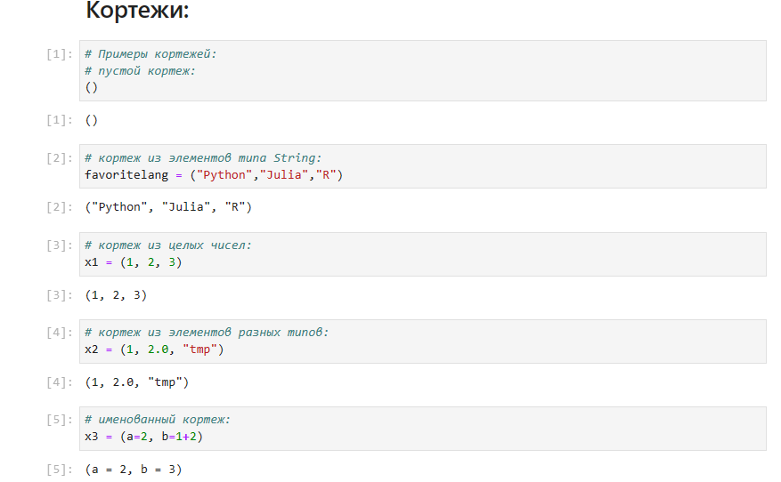{width=70% height=70%}

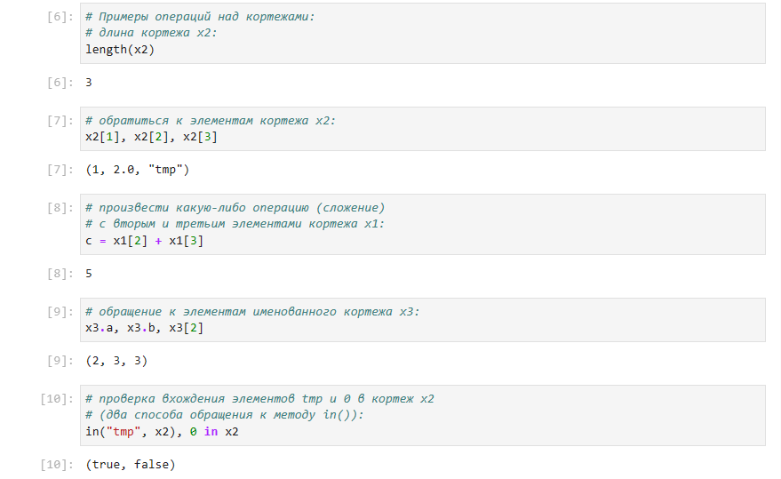{width=70% height=70%}

## Словари

Словарь — неупорядоченный набор связанных между собой по ключу данных.

Синтаксис определения словаря: ```Dict(key1 => value1, key2 => value2, ...)```

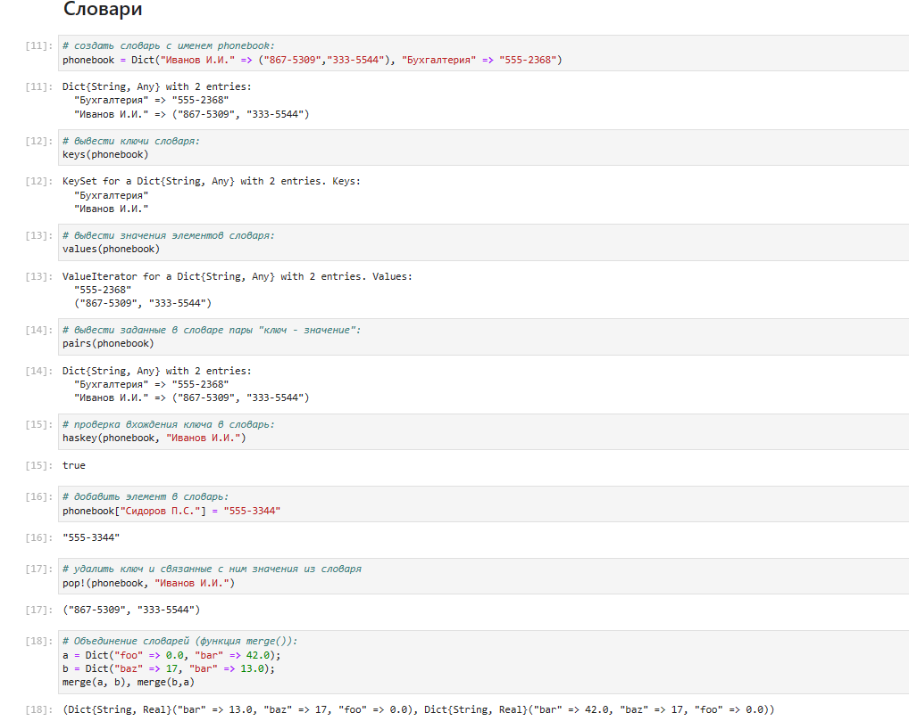{width=70% height=70%}

## Множества

Множество, как структура данных в Julia, соответствует множеству, как математическому объекту, то есть является неупорядоченной совокупностью элементов какого-либо типа. Возможные операции над множествами: объединение, пересечение, разность; принадлежность элемента множеству.

Синтаксис определения множества: ```Set([itr])```, где ```itr``` — набор значений, сгенерированных данным итерируемым объектом или пустое множество.

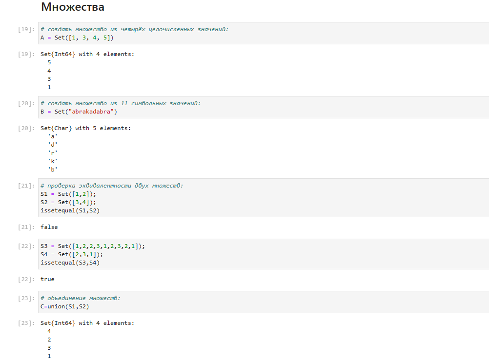{width=70% height=70%}

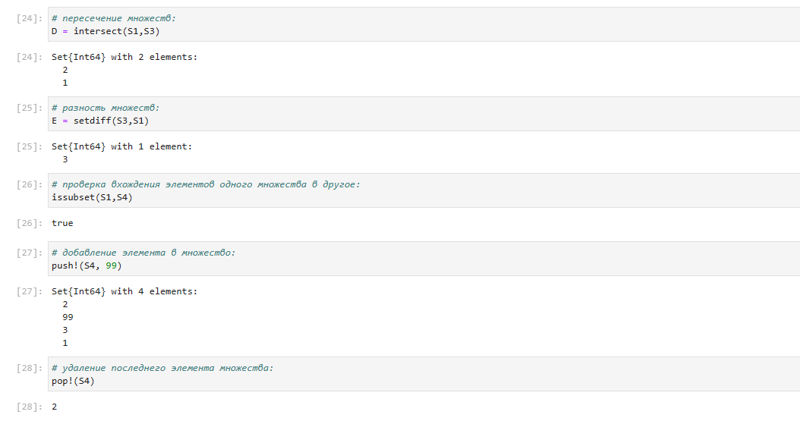{width=70% height=70%}

## Массивы

Массив — коллекция упорядоченных элементов, размещённая в многомерной сетке. Векторы и матрицы являются частными случаями массивов.

Общий синтаксис одномерных массивов:
```
array_name_1 = [element1, element2, ...]
array_name_2 = [element1 element2 ...]
```
Некоторые операции для работы с массивами:

– ```length(A)``` — число элементов массива A;

– ```ndims(A)``` — число размерностей массива A;

– ```size(A)``` — кортеж размерностей массива A;

– ```size(A, n)``` — размерность массива A в заданном направлении;

– ```copy(A)``` — создание копии массива A;

– ```ones(), zeros()``` — создать массив с единицами или нулями соответственно;

– ```fill(value,array_name)``` — заполнение массива заранее определенным значением;

– ```sort()``` — сортировка элементов;

– ```collect()``` — вернуть массив всех элементов в коллекции или итераторе;

– ```reshape()``` — изменение размера массива;

– ```transpose()``` — транспонирование массива;

Примеры массивов:

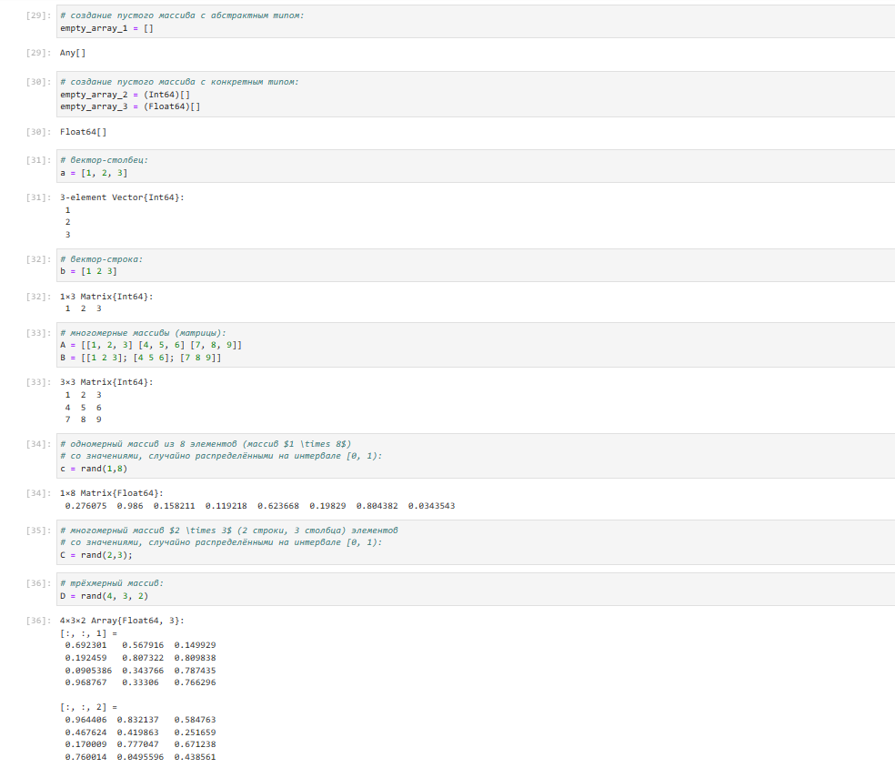{width=70% height=70%}

Примеры массивов, заданных некоторыми функциями через включение:

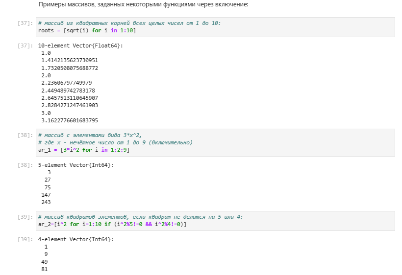{width=70% height=70%}

Некоторые операции для работы с массивами:

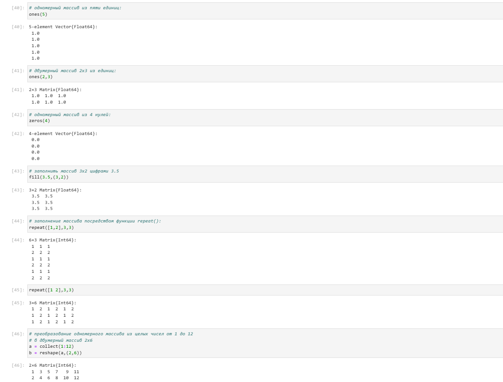{width=70% height=70%}

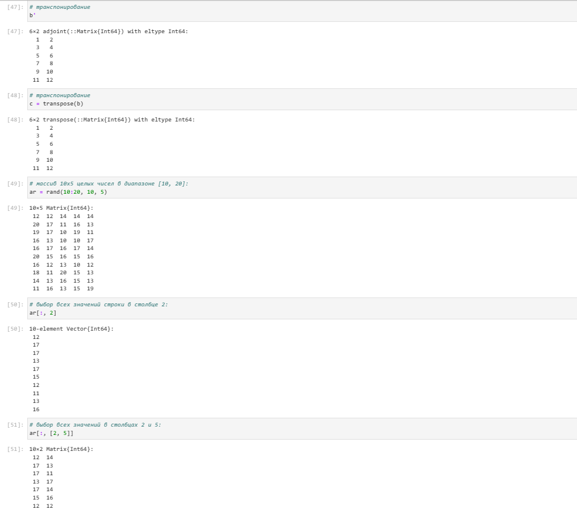{width=70% height=70%}

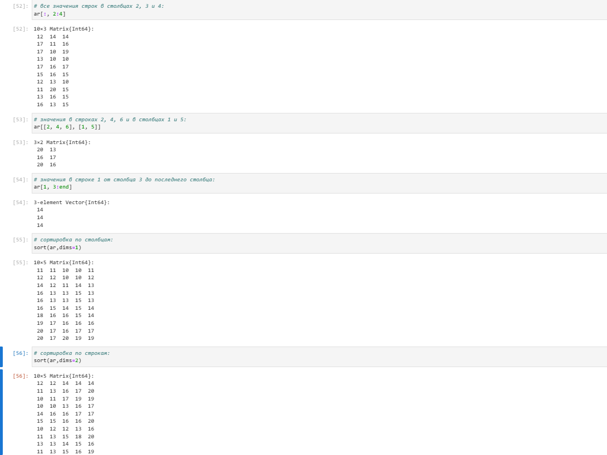{width=70% height=70%}

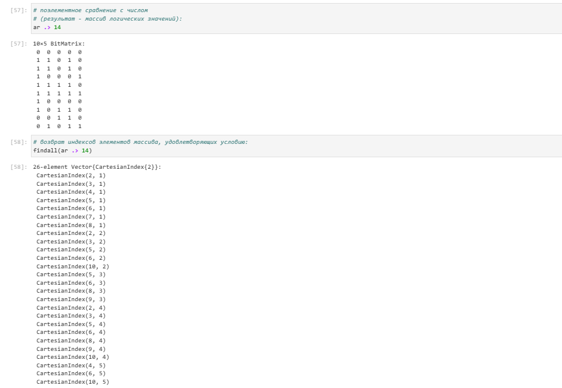{width=70% height=70%}

##  Задания для самостоятельного выполнения

1. Даны множества: $A= \{0, 3, 4, 9\}, B=\{1, 3, 4, 7\}, C=\{0, 1, 2, 4, 7, 8, 9\}$. Найти $P=A \cap B \cup A \cap B \cup A \cap C \cup B \cap C$

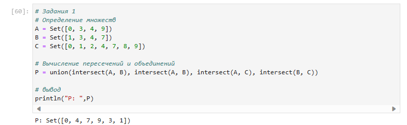{width=70% height=70%}

2. Приведите свои примеры с выполнением операций над множествами элементов разных типов.

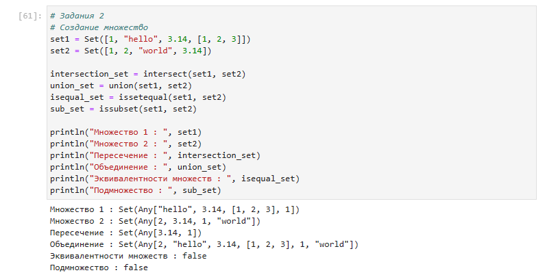{width=70% height=70%}

3. Создайте разными способами:

3.1. массив $(1, 2, 3,..., N − 1, N ), N$ выберите больше 20;

3.2 массив $(N, N − 1,... , 2, 1), N$ выберите больше 20;

3.3. массив $(1, 2, 3, … , N − 1, N, N − 1, … , 2, 1), N$ выберите больше 20;

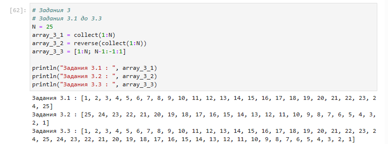{width=70% height=70%}

3.4. массив с именем tmp вида $(4, 6, 3)$;

3.5. массив, в котором первый элемент массива tmp повторяется 10 раз;

3.6. массив, в котором все элементы массива tmp повторяются 10 раз;

3.7. массив, в котором первый элемент массива tmp встречается 11 раз, второй элемент — 10 раз, третий элемент — 10 раз

3.8. массив, в котором первый элемент массива tmp встречается 10 раз подряд, второй
элемент — 20 раз подряд, третий элемент — 30 раз подряд;

3.9. массив из элементов вида $2^{tmp[i]}$, $i = 1,2,3,$ где элемент$2^{tmp[3]}$ встречается 4
раза; посчитайте в полученном векторе, сколько раз встречается цифра 6, и выведите это значение на экран;

3.10. вектор значений $y=e^{x}cos(x)$ в точках $x=3,3.1,3.2,...,6,$ найдите среднее
значение $𝑦$;

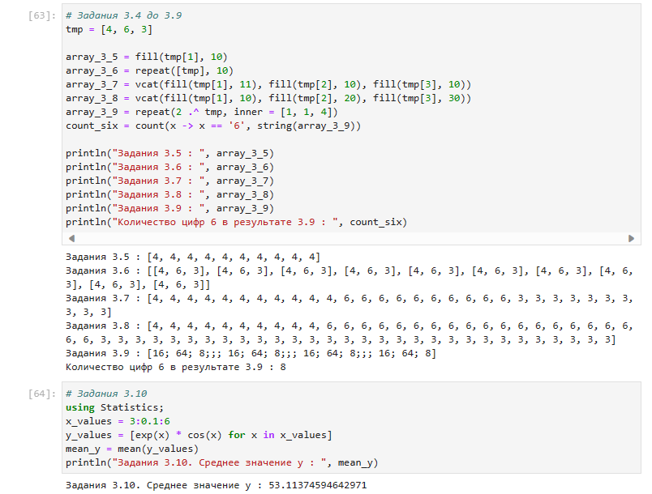{width=70% height=70%}

3.11. вектор вида $(x^{i}, y^{j}), x=0.1,i=3,6,9,...,36, y=0.2, j=1,4,7,...,34;$

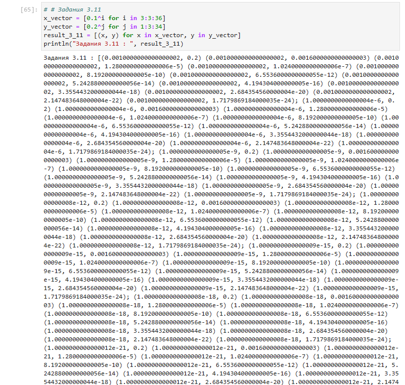{width=70% height=70%}

3.12. вектор с элементами $\frac{2^{i}}{i}$, $i=1,2,...,M, M=25$

3.13. вектор вида $("fn1","fn2", ...,"fnN"), N=30$

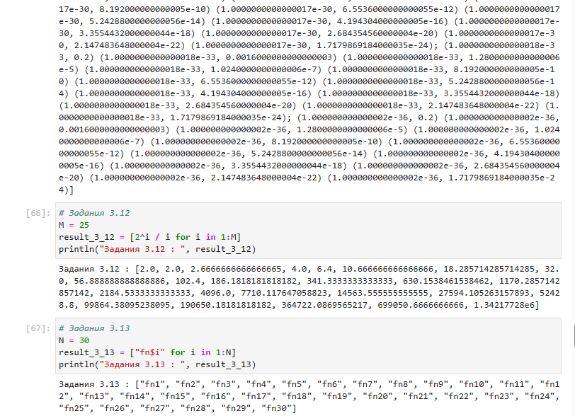{width=70% height=70%}

3.14. векторы $x=(x_1,x_2,...,x_n)$ и $y=(y_1,y_2,...,y_n)$ целочисленного типа длины $n=250$ как случайные выборки из совокупности $0, 1, … , 999$; на его основе: 

3.14.1. сформируйте вектор $(y_2-x_1, ..., y_n-x_{n-1})$

3.14.2. сформируйте вектор $(x_1+2x_2-x_3, x_2+2x_3-x_4,..., x_{n-2}+2x_{n-1}-x_n)$

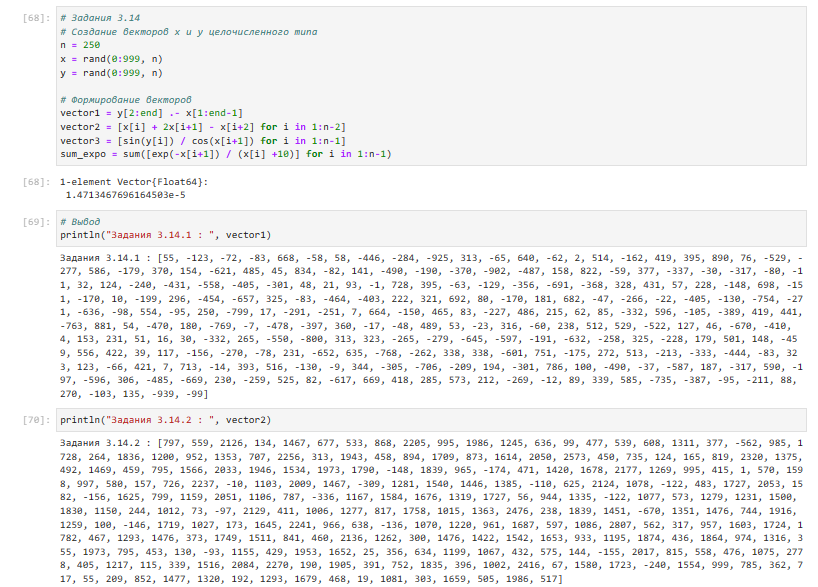{width=70% height=70%}

3.14.3. сформируйте вектор $(\frac{sin(y_1)}{cos(x_2)}, \frac{sin(y_2)}{cos(x_3)},..., \frac{sin(y_{n-1})}{cos(x_n)})$ 

3.14.4. вычислите $\sum_{i=1}^{n-1} \frac{e^{-x_{i+1}}}{x_i+10}$

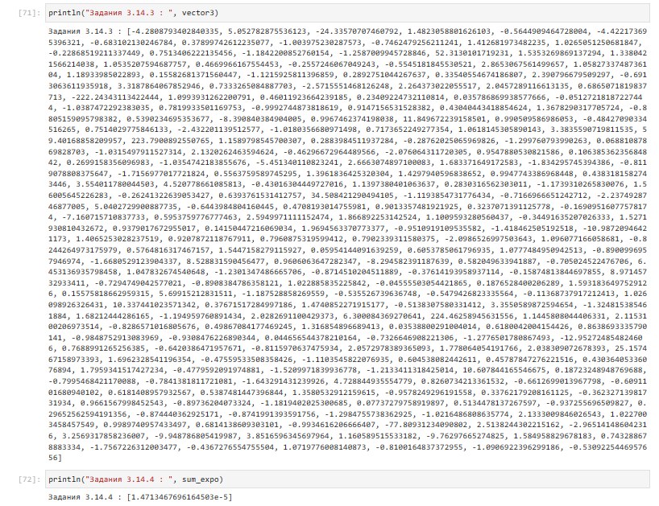{width=70% height=70%}

3.14.5. выберите элементы вектора $𝑦$, значения которых больше 600, и выведите на экран; определите индексы этих элементов;

3.14.6. определите значения вектора $𝑥$, соответствующие значениям вектора $𝑦$, значения которых больше 600 (под соответствием понимается расположение на аналогичных индексных позициях);
  
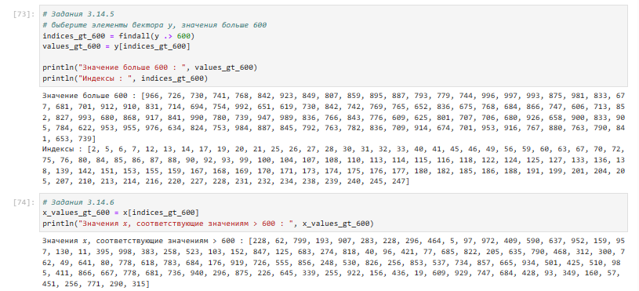{width=70% height=70%}

3.14.7. сформируйте вектор $(|x_1-\bar x|^{\frac{1}{2}}, |x_2-\bar x|^{\frac{1}{2}},..., |x_n-\bar x|^{\frac{1}{2}})$, где $\bar x$ обозначает среднее значение вектора $x=(x_1, x_2,..., x_n)$ 

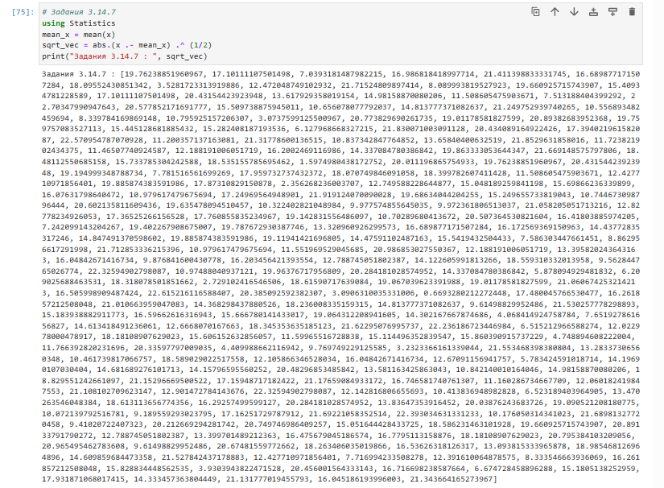{width=70% height=70%}

3.14.8. определите, сколько элементов вектора $𝑦$ отстоят от максимального значения не более, чем на 200;

3.14.9. определите, сколько чётных и нечётных элементов вектора $𝑥$;

3.14.10. определите, сколько элементов вектора $𝑥$ кратны 7;

3.14.11. отсортируйте элементы вектора $𝑥$ в порядке возрастания элементов вектора $𝑦$;

3.14.12. выведите элементы вектора $𝑥$, которые входят в десятку наибольших (top-10)?

3.14.13. сформируйте вектор, содержащий только уникальные (неповторяющиеся) элементы вектора $x$

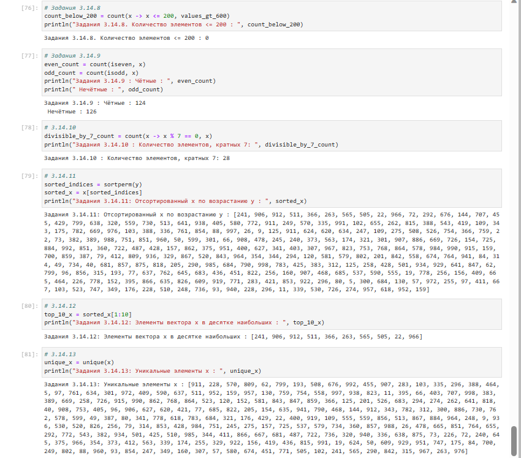{width=70% height=70%}

4. Создайте массив squares, в котором будут храниться квадраты всех целых чисел от 1 до 100.

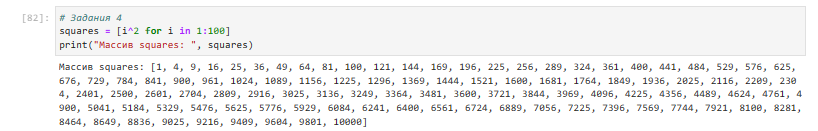{width=70% height=70%}
   
5. Подключите пакет Primes (функции для вычисления простых чисел). Сгенерируйте массив myprimes, в котором будут храниться первые 168 простых чисел. Определите 89-е наименьшее простое число. Получите срез массива с 89-го до 99-го элемента включительно, содержащий наименьшие простые числа.

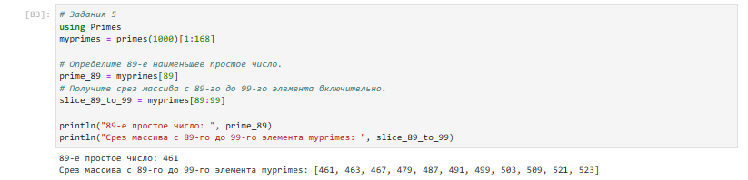{width=70% height=70%}

6. Вычислите следующие выражения:

6.1. $\sum_{i=10}^{100} (i^3+4i^2)$

6.2. $\sum_{i=1}^{M} (\frac{2^i}{i} + \frac{3^i}{i^2}), M=25$

6.3. $1+\frac{2}{3}+(\frac{2}{3}\frac{4}{5}) + (\frac{2}{3}\frac{4}{5}\frac{6}{7})+...+(\frac{2}{3}\frac{4}{5}...\frac{38}{39})$

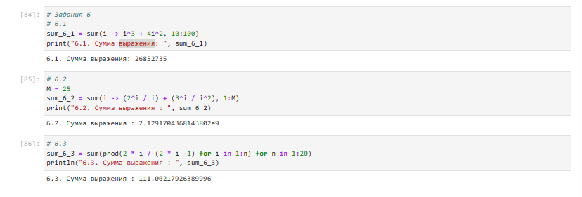{width=70% height=70%}

# Листинги  программы

```julia
# Задания 1
# Определение множеств
A = Set([0, 3, 4, 9])
B = Set([1, 3, 4, 7])
C = Set([0, 1, 2, 4, 7, 8, 9])

# Вычисление пересечений и объединений
P = union(intersect(A, B), intersect(A, B), intersect(A, C), intersect(B, C))

# вывод
println("P: ",P)

# Задания 2
# Создание множество 
set1 = Set([1, "hello", 3.14, [1, 2, 3]])
set2 = Set([1, 2, "world", 3.14])

intersection_set = intersect(set1, set2)
union_set = union(set1, set2)
isequal_set = issetequal(set1, set2)
sub_set = issubset(set1, set2)

println("Множество 1 : ", set1)
println("Множество 2 : ", set2)
println("Пересечение : ", intersection_set)
println("Объединение : ", union_set)
println("Эквивалентности множеств : ", isequal_set)
println("Подмножество : ", sub_set)

# Задания 3
# Задания 3.1 до 3.3
N = 25
array_3_1 = collect(1:N)
array_3_2 = reverse(collect(1:N))
array_3_3 = [1:N; N-1:-1:1]

println("Задания 3.1 : ", array_3_1)
println("Задания 3.2 : ", array_3_2)
println("Задания 3.3 : ", array_3_3)

# Задания 3.4 до 3.9
tmp = [4, 6, 3]

array_3_5 = fill(tmp[1], 10)
array_3_6 = repeat([tmp], 10)
array_3_7 = vcat(fill(tmp[1], 11), fill(tmp[2], 10), fill(tmp[3], 10))
array_3_8 = vcat(fill(tmp[1], 10), fill(tmp[2], 20), fill(tmp[3], 30))
array_3_9 = repeat(2 .^ tmp, inner = [1, 1, 4])
count_six = count(x -> x == '6', string(array_3_9))

println("Задания 3.5 : ", array_3_5)
println("Задания 3.6 : ", array_3_6)
println("Задания 3.7 : ", array_3_7)
println("Задания 3.8 : ", array_3_8)
println("Задания 3.9 : ", array_3_9)
println("Количество цифр 6 в результате 3.9 : ", count_six)

# Задания 3.10
using Statistics;
x_values = 3:0.1:6
y_values = [exp(x) * cos(x) for x in x_values]
mean_y = mean(y_values)
println("Задания 3.10. Среднее значение y : ", mean_y)

# # Задания 3.11
x_vector = [0.1^i for i in 3:3:36]
y_vector = [0.2^j for j in 1:3:34]
result_3_11 = [(x, y) for x in x_vector, y in y_vector]
println("Задания 3.11 : ", result_3_11)

# Задания 3.12
M = 25
result_3_12 = [2^i / i for i in 1:M]
println("Задания 3.12 : ", result_3_12)

# Задания 3.13
N = 30
result_3_13 = ["fn$i" for i in 1:N]
println("Задания 3.13 : ", result_3_13)

# Задания 3.14
# Создание векторов x и y целочисленного типа
n = 250
x = rand(0:999, n)
y = rand(0:999, n)

# Формирование векторов
vector1 = y[2:end] .- x[1:end-1]
vector2 = [x[i] + 2x[i+1] - x[i+2] for i in 1:n-2]
vector3 = [sin(y[i]) / cos(x[i+1]) for i in 1:n-1]
sum_expo = sum([exp(-x[i+1]) / (x[i] +10)] for i in 1:n-1)

# Вывод
println("Задания 3.14.1 : ", vector1)
println("Задания 3.14.2 : ", vector2)
println("Задания 3.14.3 : ", vector3)
println("Задания 3.14.4 : ", sum_expo)

# Задания 3.14.5
# выберите элементы вектора y, значения больше 600
indices_gt_600 = findall(y .> 600)
values_gt_600 = y[indices_gt_600]

println("Значение больше 600 : ", values_gt_600)
println("Индексы : ", indices_gt_600)

# Задания 3.14.6
x_values_gt_600 = x[indices_gt_600]
println("Значения x, соответствующие значениям > 600 : ", x_values_gt_600)

# Задания 3.14.7
using Statistics
mean_x = mean(x)
sqrt_vec = abs.(x .- mean_x) .^ (1/2)
print("Задания 3.14.7 : ", sqrt_vec)

# Задания 3.14.8
count_below_200 = count(x -> x <= 200, values_gt_600)
println("Задания 3.14.8. Количество элементов <= 200 : ", count_below_200)

# Задания 3.14.9
even_count = count(iseven, x)
odd_count = count(isodd, x)
println("Задания 3.14.9 : Чётные : ", even_count)
println(" Нечётные : ", odd_count)

# 3.14.10
divisible_by_7_count = count(x -> x % 7 == 0, x)
println("Задания 3.14.10 : Количество элементов, кратных 7: ", divisible_by_7_count)

# 3.14.11
sorted_indices = sortperm(y)
sorted_x = x[sorted_indices]
println("Задания 3.14.11: Отсортированный x по возрастанию y : ", sorted_x)

# 3.14.12
top_10_x = sorted_x[1:10]
println("Задания 3.14.12: Элементы вектора x в десятке наибольших : ", top_10_x)

# 3.14.13
unique_x = unique(x)
println("Задания 3.14.13: Уникальные элементы x : ", unique_x)

# Задания 4
squares = [i^2 for i in 1:100]
print("Массив squares: ", squares)

# Задания 5
using Primes
myprimes = primes(1000)[1:168]

# Определите 89-е наименьшее простое число.
prime_89 = myprimes[89]
# Получите срез массива с 89-го до 99-го элемента включительно.
slice_89_to_99 = myprimes[89:99]

println("89-е простое число: ", prime_89)
println("Срез массива с 89-го до 99-го элемента myprimes: ", slice_89_to_99)

# Задания 6
# 6.1
sum_6_1 = sum(i -> i^3 + 4i^2, 10:100)
print("6.1. Сумма выражения: ", sum_6_1)
# 6.2
M = 25
sum_6_2 = sum(i -> (2^i / i) + (3^i / i^2), 1:M)
print("6.2. Сумма выражения : ", sum_6_2)
# 6.3
sum_6_3 = sum(prod(2 * i / (2 * i -1) for i in 1:n) for n in 1:20)
println("6.3. Сумма выражения : ", sum_6_3)
```

# Вывод

Изучила несколько структур данных, реализованных в Julia, научиться применять их и операции над ними для решения задач.
