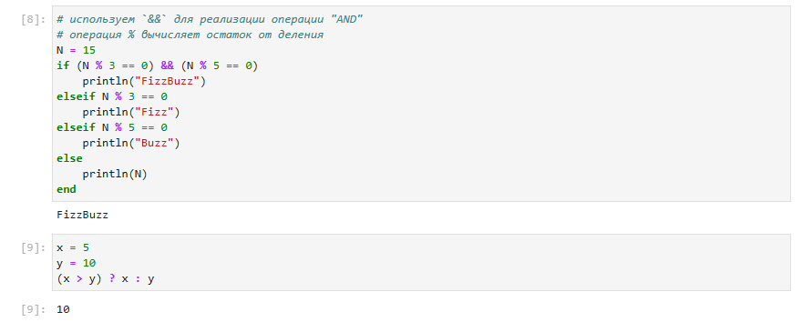

---
## Front matter
lang: ru-RU
title: Лабораторная работа №3
subtitle:  Управляющие структуры
author: |
	 Ким Реачна\inst{1}

institute: |
	\inst{1}Российский Университет Дружбы Народов

date: 21 ноября, 2023, Москва, Россия

## Formatting
mainfont: PT Serif
romanfont: PT Serif
sansfont: PT Sans
monofont: PT Mono
toc: false
slide_level: 2
theme: metropolis
header-includes: 
 - \metroset{progressbar=frametitle,sectionpage=progressbar,numbering=fraction}
 - '\makeatletter'
 - '\beamer@ignorenonframefalse'
 - '\makeatother'
aspectratio: 43
section-titles: true

---
# Цели и задачи

## Цель лабораторной работы

Основная цель работы — освоить применение циклов функций и сторонних для Julia пакетов для решения задач линейной алгебры и работы с матрицами.

## Задание

1. Используя Jupyter Lab, повторите примеры.
2. Выполните задания для самостоятельной работы.

# Процесс выполнения лабораторной работы

## Циклы while и for

{width=80% height=80% }

## Условные выражения

{width=80% height=80% }

## Функции

{width=80% height=80% }

## Сторонние библиотеки (пакеты) в Julia

{width=80% height=80% }

## Задания для самостоятельного выполнения

{width=70% height=70% }

# Выводы по проделанной работе

## Вывод

Освоила применение циклов функций и сторонних для Julia пакетов для решения задач линейной алгебры и работы с матрицами.
