---
## Front matter
title: "Отчёт по лабораторной работе №3"
subtitle: "Управляющие структуры"
author: "Ким Реачна"

## Generic otions
lang: ru-RU
toc-title: "Содержание"

## Bibliography
bibliography: bib/cite.bib
csl: pandoc/csl/gost-r-7-0-5-2008-numeric.csl

## Pdf output format
toc: true # Table of contents
toc-depth: 2
lof: true # List of figures
fontsize: 12pt
linestretch: 1.5
papersize: a4
documentclass: scrreprt
## I18n polyglossia
polyglossia-lang:
  name: russian
  options:
	- spelling=modern
	- babelshorthands=true
polyglossia-otherlangs:
  name: english
## I18n babel
babel-lang: russian
babel-otherlangs: english
## Fonts
mainfont: PT Serif
romanfont: PT Serif
sansfont: PT Sans
monofont: PT Mono
mainfontoptions: Ligatures=TeX
romanfontoptions: Ligatures=TeX
sansfontoptions: Ligatures=TeX,Scale=MatchLowercase
monofontoptions: Scale=MatchLowercase,Scale=0.9
## Biblatex
biblatex: true
biblio-style: "gost-numeric"
biblatexoptions:
  - parentracker=true
  - backend=biber
  - hyperref=auto
  - language=auto
  - autolang=other*
  - citestyle=gost-numeric
## Pandoc-crossref LaTeX customization
figureTitle: "Рис."
listingTitle: "Листинг"
lofTitle: "Список иллюстраций"
lolTitle: "Листинги"
## Misc options
indent: true
header-includes:
  - \usepackage{indentfirst}
  - \usepackage{float} # keep figures where there are in the text
  - \floatplacement{figure}{H} # keep figures where there are in the text
---

# Цель работы

Основная цель работы — освоить применение циклов функций и сторонних для Julia пакетов для решения задач линейной алгебры и работы с матрицами.

# Выполнение лабораторной работы

##   Циклы while и for

Для различных операций, связанных с перебором индексируемых элементов структур данных, традиционно используются циклы while и for.

Синтаксис ```while```:

```julia
while <условие>
    <тело цикла>
end
```
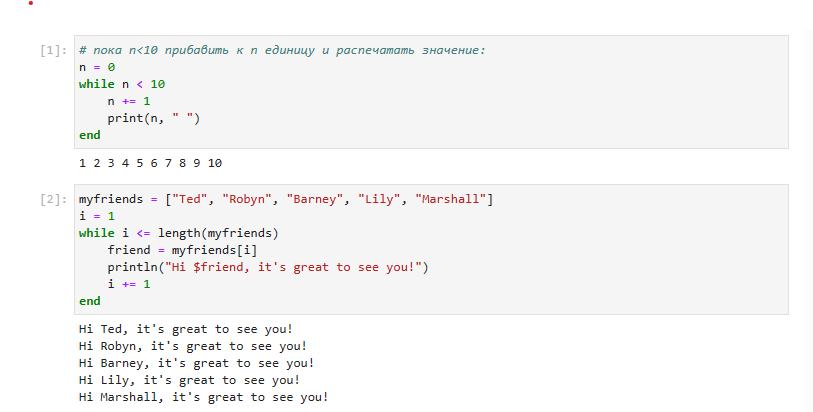

Синтаксис ```for```:

```julia
for <переменная> in <диапазон>
    <тело цикла>
end
```
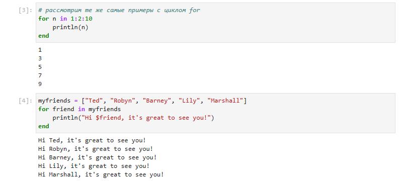

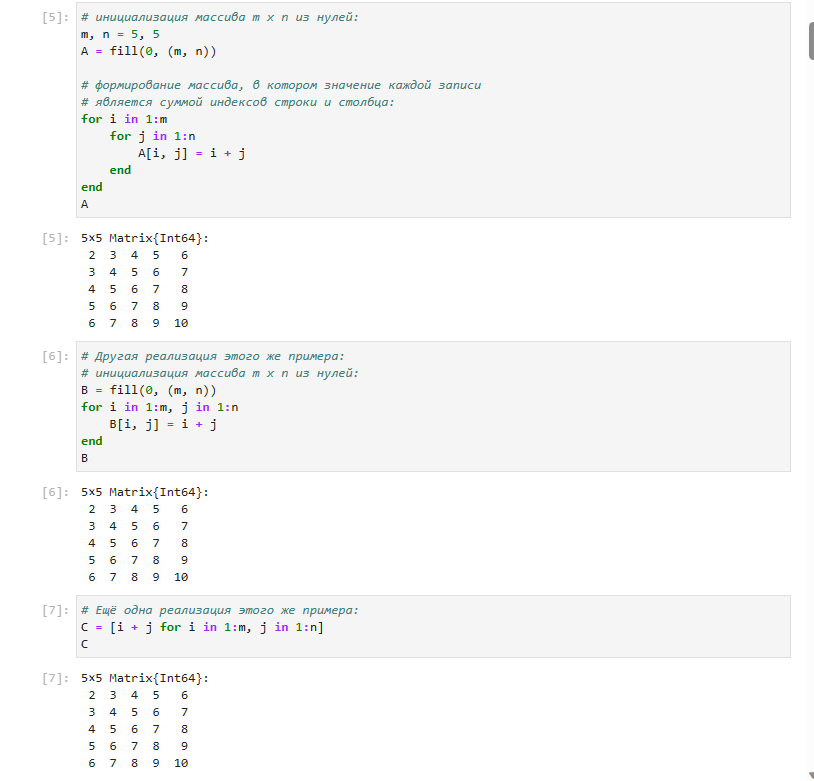

##  Условные выражения

Довольно часто при решении задач требуется проверить выполнение тех или иных условий. Для этого используют условные выражения.

Синтаксис условных выражений с ключевым словом:

```julia
if <условие 1>
    <действие 1>
elseif <условие 2>
    <действие 2>
else
    <действие 3>
end
```
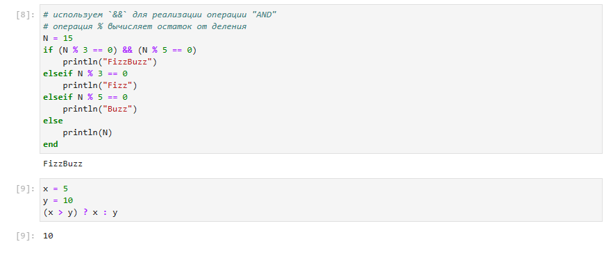

## Функции

Julia  дает  нам  несколько  разных  способов  написать  функцию.  Первый требует ключевых слов function и end:

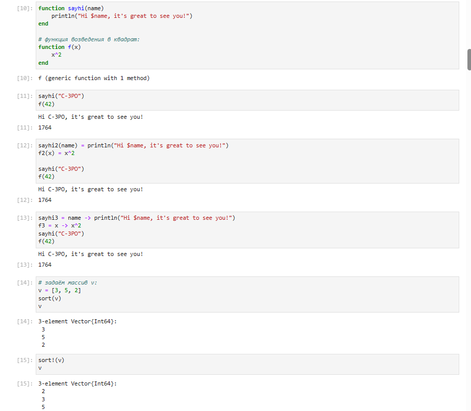

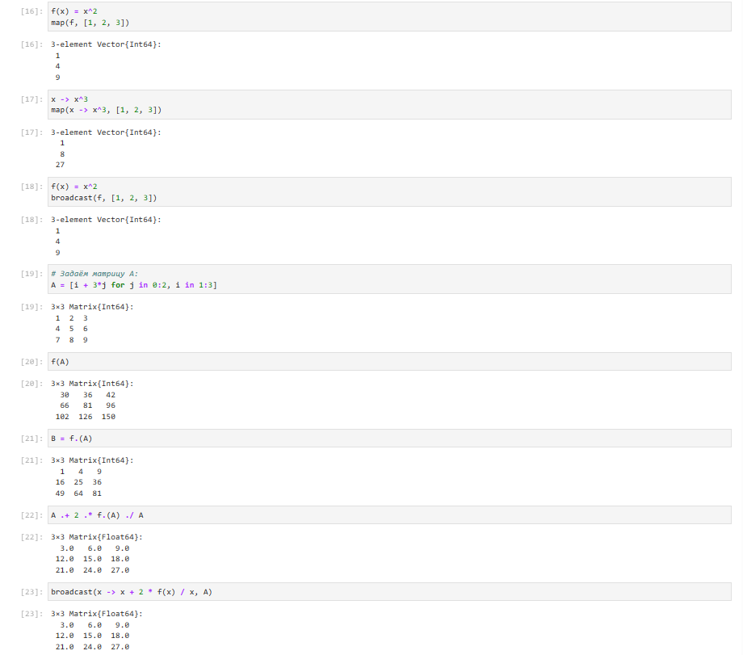

## Сторонние библиотеки (пакеты) в Julia

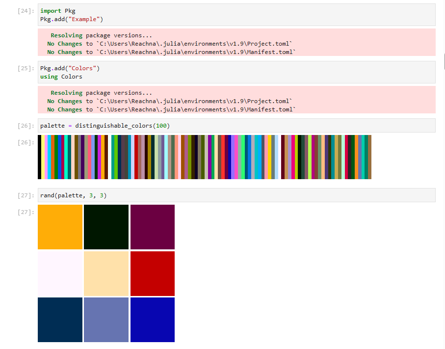

##  Задания для самостоятельного выполнения

1. Используя циклы while и for:
  - выведите на экран целые числа от 1 до 100 и напечатайте их квадраты;
  
  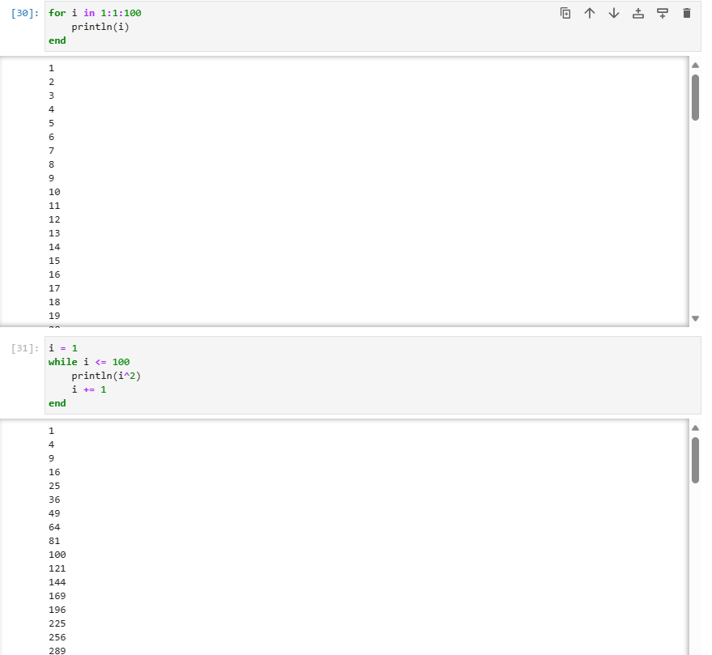

  - создайте словарь squares, который будет содержать целые числа в качестве ключей и квадраты в качестве их пар-значений;

  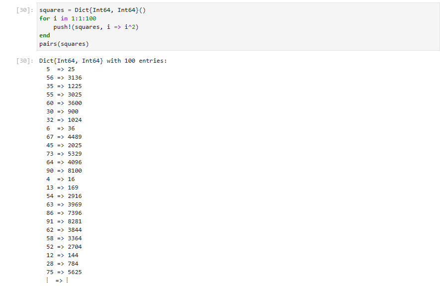
    
  - создайте массив squares_arr, содержащий квадраты всех чисел от 1 до 100.

  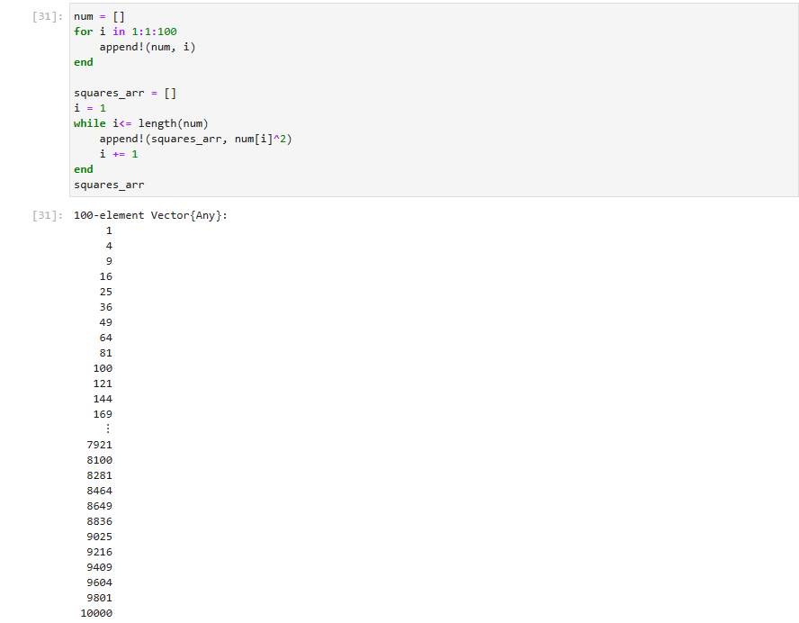

2. Напишите условный оператор, который печатает число, если число чётное, и строку «нечётное», если число нечётное. Перепишите код, используя тернарный оператор.

3. Напишите функцию add_one, которая добавляет 1 к своему входу.

4. Используйте map() или broadcast() для задания матрицы $𝐴$, каждый элемент которой увеличивается на единицу по сравнению с предыдущим.

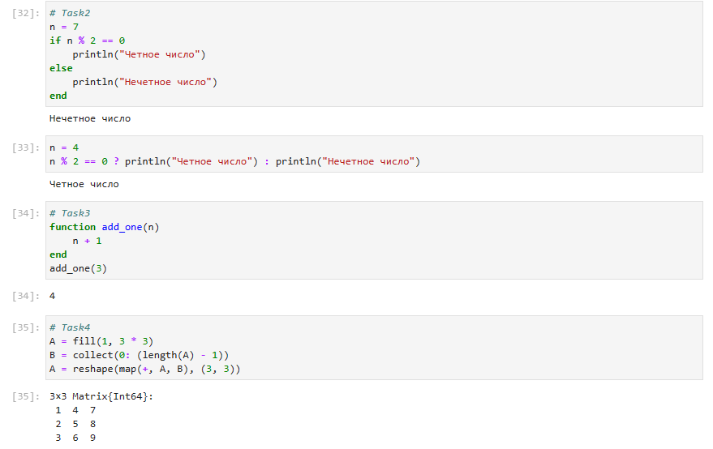

5. Задайте матрицу $𝐴$

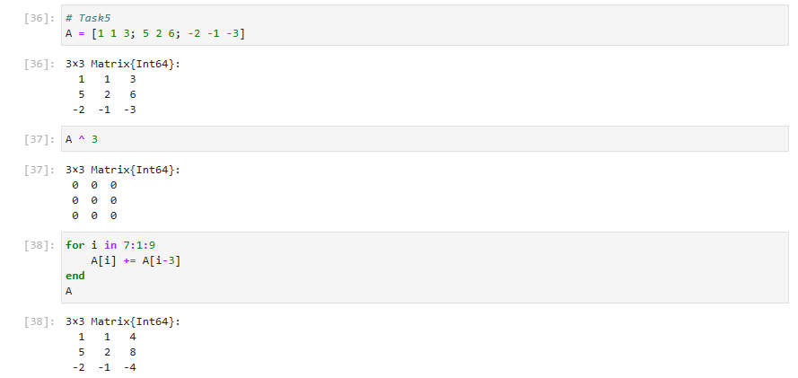

6. Создайте матрицу $𝐵$ с элементами $𝐵_{i1} = 10, 𝐵_{i2} = −10, 𝐵_{i3} = 10, 𝑖 = 1, 2,... , 15$. Вычислите матрицу $𝐶 = (𝐵^𝑇)𝐵$.

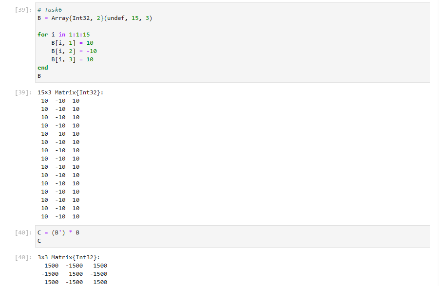

7. Создайте матрицу $𝑍$ размерности 6 × 6, все элементы которой равны нулю, и матрицу $𝐸$, все элементы которой равны 1. Используя цикл while или for и закономерности расположения элементов, создайте следующие матрицы размерности 6 × 6.

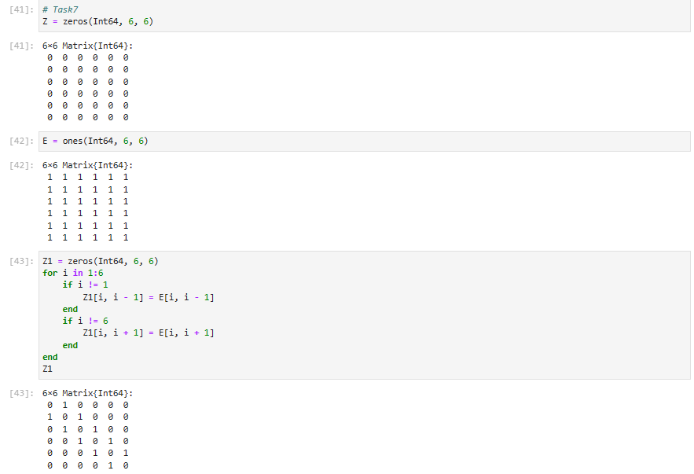

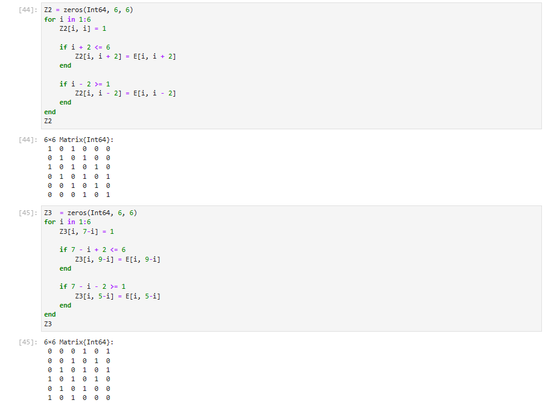

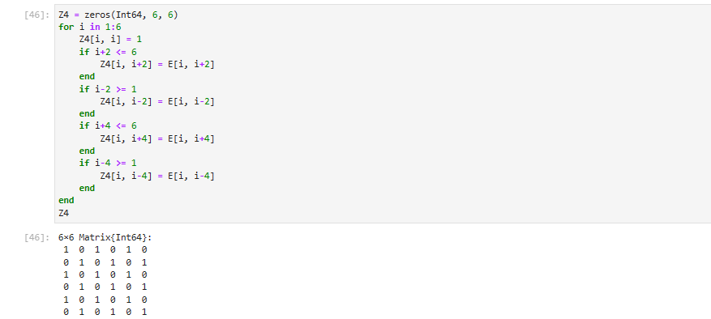

8. Напишите свою функцию, аналогичную функции outer() языка R. Функция должна иметь следующий интерфейс: ```outer(x,y,operation)```.


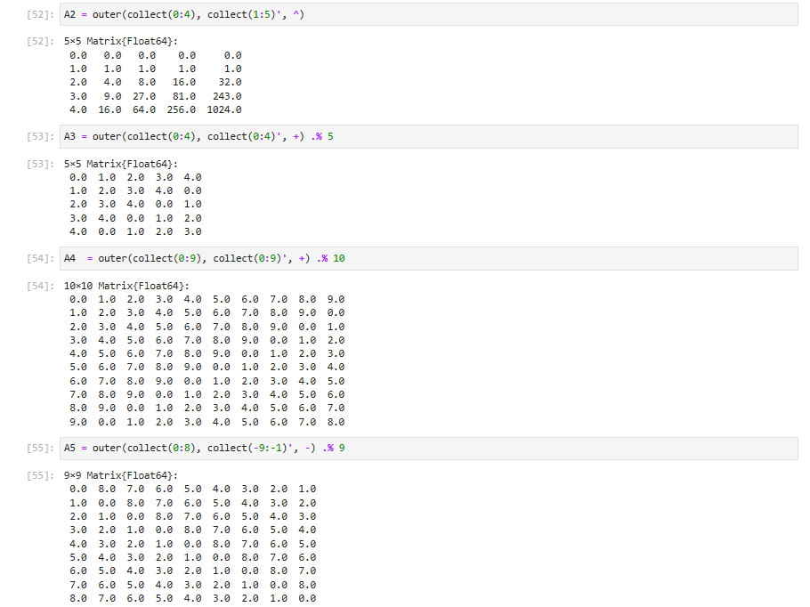

9. Решите следующую систему линейных уравнений с 5 неизвестными.

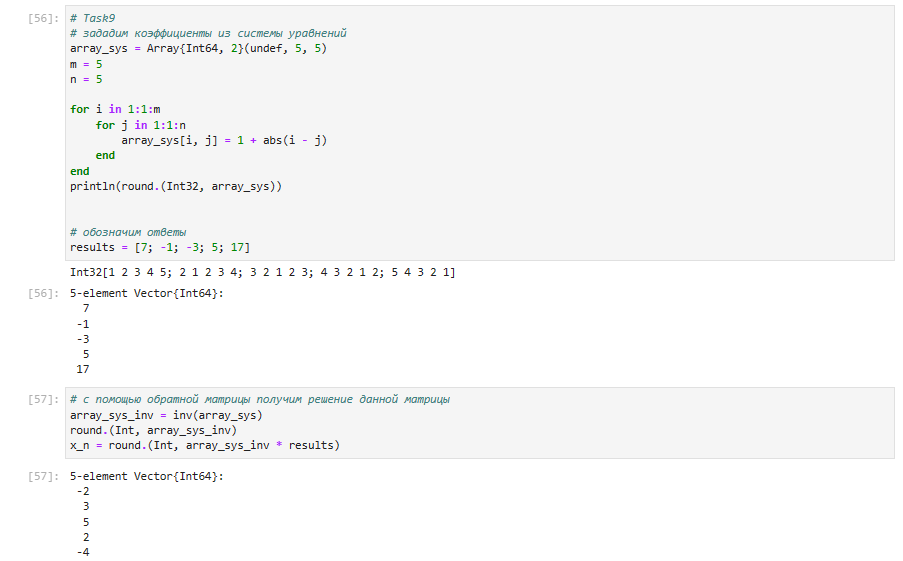

10. Создайте матрицу $𝑀$ размерности $6 × 10$, элементами которой являются целые числа, выбранные случайным образом с повторениями из совокупности $1, 2, … , 10$.

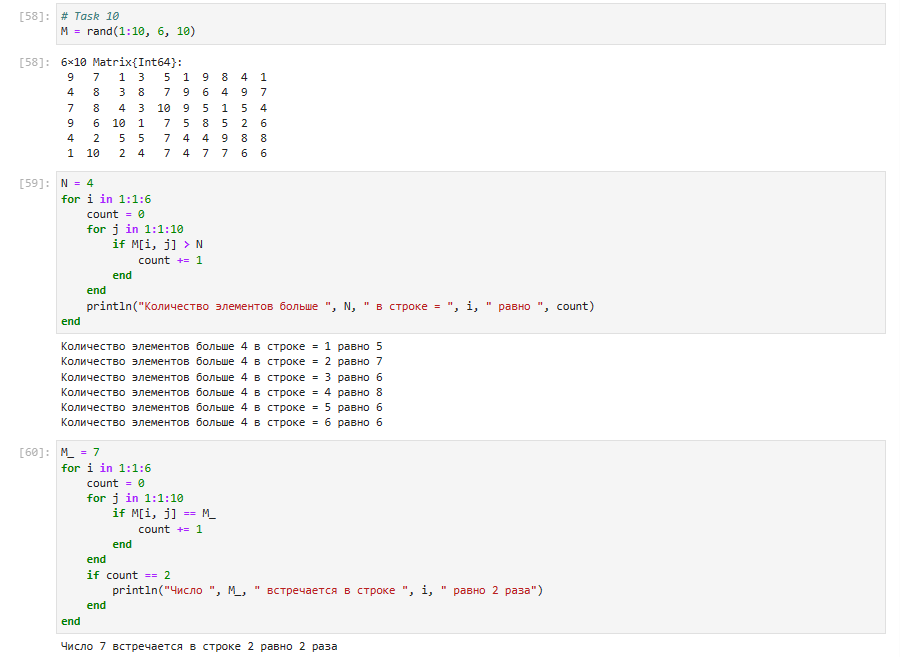


11. Вычислите:  
    
$\sum_{i=1}^{20}\sum_{j=1}^5\frac{i^{4}}{3+j}$
    
$\sum_{i=1}^{20}\sum_{j=1}^5\frac{i^{4}}{3+ij}$ 

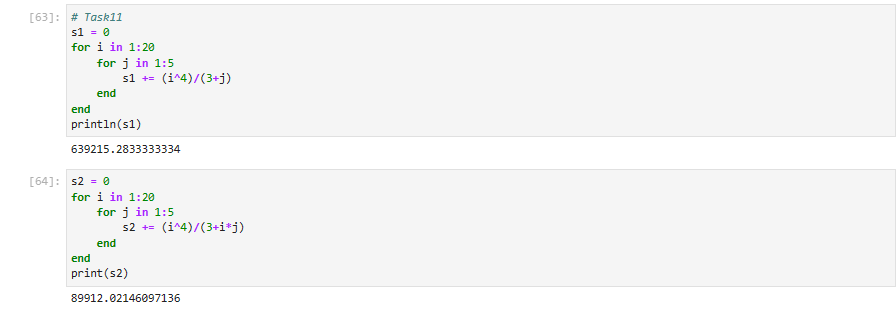


# Листинги  программы

```julia
# пока n<10 прибавить к n единицу и распечатать значение:
n = 0
while n < 10
    n += 1
    println(n)
end
1
2
3
4
5
6
7
8
9
10
myfriends = ["Ted", "Robyn", "Barney", "Lily", "Marshall"]
i = 1
while i <= length(myfriends)
    friend = myfriends[i]
    println("Hi $friend, it's great to see you!")
    i += 1
end
Hi Ted, it's great to see you!
Hi Robyn, it's great to see you!
Hi Barney, it's great to see you!
Hi Lily, it's great to see you!
Hi Marshall, it's great to see you!
for n in 1:2:10
    println(n)
end
1
3
5
7
9
myfriends = ["Ted", "Robyn", "Barney", "Lily", "Marshall"]
for friend in myfriends
    println("Hi $friend, it's great to see you!")
end
Hi Ted, it's great to see you!
Hi Robyn, it's great to see you!
Hi Barney, it's great to see you!
Hi Lily, it's great to see you!
Hi Marshall, it's great to see you!
# инициализация массива m x n из нулей:
m, n = 5, 5
A = fill(0, (m, n))

# формирование массива, в котором значение каждой записи
# является суммой индексов строки и столбца:
for i in 1:m
    for j in 1:n
        A[i, j] = i + j
    end
end
A
5×5 Matrix{Int64}:
 2  3  4  5   6
 3  4  5  6   7
 4  5  6  7   8
 5  6  7  8   9
 6  7  8  9  10
# инициализация массива m x n из нулей:
B = fill(0, (m, n))
for i in 1:m, j in 1:n
    B[i, j] = i + j
end
B
5×5 Matrix{Int64}:
 2  3  4  5   6
 3  4  5  6   7
 4  5  6  7   8
 5  6  7  8   9
 6  7  8  9  10
C = [i + j for i in 1:m, j in 1:n]
C
5×5 Matrix{Int64}:
 2  3  4  5   6
 3  4  5  6   7
 4  5  6  7   8
 5  6  7  8   9
 6  7  8  9  10
# используем `&&` для реализации операции "AND"
# операция % вычисляет остаток от деления
N = 15
if (N % 3 == 0) && (N % 5 == 0)
    println("FizzBuzz")
elseif N % 3 == 0
    println("Fizz")
elseif N % 5 == 0
    println("Buzz")
else
    println(N)
end
FizzBuzz
x = 5
y = 10
(x > y) ? x : y
10
function sayhi(name)
    println("Hi $name, it's great to see you!")
end

# функция возведения в квадрат:
function f(x)
    x^2
end
f (generic function with 1 method)
sayhi("C-3PO")
f(42)
Hi C-3PO, it's great to see you!
1764
sayhi2(name) = println("Hi $name, it's great to see you!")
f2(x) = x^2
Hi C-3PO, it's great to see you!
1764
sayhi3 = name -> println("Hi $name, it's great to see you!")
f3 = x -> x^2
sayhi("C-3PO")
f(42)
Hi C-3PO, it's great to see you!
1764
# задаём массив v:
v = [3, 5, 2]
sort(v)
v
3-element Vector{Int64}:
 3
 5
 2
sort!(v)
v
3-element Vector{Int64}:
 1
 4
 9
x -> x^3
map(x -> x^3, [1, 2, 3])
3-element Vector{Int64}:
  1
  8
 27
f(x) = x^2
broadcast(f, [1, 2, 3])
3-element Vector{Int64}:
 1
 4
 9
# Задаём матрицу A:
A = [i + 3*j for j in 0:2, i in 1:3]
3×3 Matrix{Int64}:
 1  2  3
 4  5  6
 7  8  9
f(A)
3×3 Matrix{Int64}:
  30   36   42
  66   81   96
 102  126  150
B = f.(A)
3×3 Matrix{Int64}:
  1   4   9
 16  25  36
 49  64  81
A .+ 2 .* f.(A) ./ A
3×3 Matrix{Float64}:
  3.0   6.0   9.0
 12.0  15.0  18.0
 21.0  24.0  27.0
broadcast(x -> x + 2 * f(x) / x, A)
3×3 Matrix{Float64}:
  3.0   6.0   9.0
 12.0  15.0  18.0
 21.0  24.0  27.0
palette = distinguishable_colors(100)
rand(palette, 3, 3)
# task1
for i in 1:1:100
    println(i)
end
end
i = 1
while i <= 100
    println(i^2)
    i += 1
end
squares = Dict{Int64, Int64}()
for i in 1:1:100
    push!(squares, i => i^2)
end
pairs(squares)
Dict{Int64, Int64} with 100 entries:
  5  => 25
  56 => 3136
  35 => 1225
  55 => 3025
  60 => 3600
  30 => 900
  32 => 1024
  6  => 36
  67 => 4489
  45 => 2025
  73 => 5329
  64 => 4096
  90 => 8100
  4  => 16
  13 => 169
  54 => 2916
  63 => 3969
  86 => 7396
  91 => 8281
  62 => 3844
  58 => 3364
  52 => 2704
  12 => 144
  28 => 784
  75 => 5625
num = []
for i in 1:1:100
    append!(num, i)
end
​
squares_arr = []
i = 1
while i<= length(num)
    append!(squares_arr, num[i]^2)
    i += 1
end
squares_arr
100-element Vector{Any}:
     1
     4
     9
    16
    25
    36
    49
    64
    81
   100
   121
   144
   169

  7921
  8100
  8281
  8464
  8649
  8836
  9025
  9216
  9409
  9604
  9801
 10000
# Task2
n = 7
if n % 2 == 0
    println("Четное число")
else
    println("Нечетное число")
end
Нечетное число
n = 4
n % 2 == 0 ? println("Четное число") : println("Нечетное число")
Четное число
# Task3
function add_one(n)
    n + 1
end
add_one(3)
4
# Task4
A = fill(1, 3 * 3)
B = collect(0: (length(A) - 1))
A = reshape(map(+, A, B), (3, 3))
3×3 Matrix{Int64}:
 1  4  7
 2  5  8
 3  6  9
# Task5
A = [1 1 3; 5 2 6; -2 -1 -3]
3×3 Matrix{Int64}:
  1   1   3
  5   2   6
 -2  -1  -3
A ^ 3
3×3 Matrix{Int64}:
 0  0  0
 0  0  0
 0  0  0
A
for i in 7:1:9
    A[i] += A[i-3]
end
A
3×3 Matrix{Int64}:
  1   1   4
  5   2   8
 -2  -1  -4
B
# Task6
B = Array{Int32, 2}(undef, 15, 3)
​
for i in 1:1:15
    B[i, 1] = 10
    B[i, 2] = -10
    B[i, 3] = 10
end
B
15×3 Matrix{Int32}:
 10  -10  10
 10  -10  10
 10  -10  10
 10  -10  10
 10  -10  10
 10  -10  10
 10  -10  10
 10  -10  10
 10  -10  10
 10  -10  10
 10  -10  10
 10  -10  10
 10  -10  10
 10  -10  10
 10  -10  10
C
C = (B') * B
C
3×3 Matrix{Int32}:
  1500  -1500   1500
 -1500   1500  -1500
  1500  -1500   1500
# Task7
Z = zeros(Int64, 6, 6)
6×6 Matrix{Int64}:
 0  0  0  0  0  0
 0  0  0  0  0  0
 0  0  0  0  0  0
 0  0  0  0  0  0
 0  0  0  0  0  0
 0  0  0  0  0  0
Int64, 6, 6
E = ones(Int64, 6, 6)
6×6 Matrix{Int64}:
 1  1  1  1  1  1
 1  1  1  1  1  1
 1  1  1  1  1  1
 1  1  1  1  1  1
 1  1  1  1  1  1
 1  1  1  1  1  1
Z1 = zeros(Int64, 6, 6)
for i in 1:6
    if i != 1
        Z1[i, i - 1] = E[i, i - 1]
    end
    if i != 6
        Z1[i, i + 1] = E[i, i + 1]
    end
end
Z1
6×6 Matrix{Int64}:
 0  1  0  0  0  0
 1  0  1  0  0  0
 0  1  0  1  0  0
 0  0  1  0  1  0
 0  0  0  1  0  1
 0  0  0  0  1  0
Z2 = zeros(Int64, 6, 6)
for i in 1:6
    Z2[i, i] = 1
    
    if i + 2 <= 6
        Z2[i, i + 2] = E[i, i + 2]
    end
    
    if i - 2 >= 1
        Z2[i, i - 2] = E[i, i - 2]
    end
end
Z2
6×6 Matrix{Int64}:
 1  0  1  0  0  0
 0  1  0  1  0  0
 1  0  1  0  1  0
 0  1  0  1  0  1
 0  0  1  0  1  0
 0  0  0  1  0  1
Z3  = zeros(Int64, 6, 6)
for i in 1:6
    Z3[i, 7-i] = 1
    
    if 7 - i + 2 <= 6
        Z3[i, 9-i] = E[i, 9-i]
    end
    
    if 7 - i - 2 >= 1
        Z3[i, 5-i] = E[i, 5-i]
    end
end
Z3
6×6 Matrix{Int64}:
 0  0  0  1  0  1
 0  0  1  0  1  0
 0  1  0  1  0  1
 1  0  1  0  1  0
 0  1  0  1  0  0
 1  0  1  0  0  0
Z4 = zeros(Int64, 6, 6)
for i in 1:6
    Z4[i, i] = 1
    if i+2 <= 6
        Z4[i, i+2] = E[i, i+2]
    end
    if i-2 >= 1
        Z4[i, i-2] = E[i, i-2]
    end
    if i+4 <= 6
        Z4[i, i+4] = E[i, i+4]
    end
    if i-4 >= 1
        Z4[i, i-4] = E[i, i-4]
    end
end
Z4
6×6 Matrix{Int64}:
 1  0  1  0  1  0
 0  1  0  1  0  1
 1  0  1  0  1  0
 0  1  0  1  0  1
 1  0  1  0  1  0
 0  1  0  1  0  1
# Task8
function outer(x, y, operation)
    if (ndims(x) == 1) x = reshape(x, (size(x, 1), size(x, 2))) end
    if (ndims(y) == 1) y = reshape(y, (size(y, 1), size(y, 2))) end
    c = zeros(size(x)[1], size(y)[2])
    for i in 1:size(x)[1], j in 1:size(y)[2], k in 1:size(x)[2]
        c[i, j] += operation(x[i, k], y[k, j])
    end
    return c
end
outer (generic function with 1 method)
# Checking the correctness
A = [1 1 3; 5 2 6; -2 -1 -3]
3×3 Matrix{Int64}:
  1   1   3
  5   2   6
 -2  -1  -3
A * A
3×3 Matrix{Int64}:
  0   0   0
  3   3   9
 -1  -1  -3
outer(A, A, *)
3×3 Matrix{Float64}:
  0.0   0.0   0.0
  3.0   3.0   9.0
 -1.0  -1.0  -3.0
A1 = outer(collect(0:4), collect(0:4)', +)
5×5 Matrix{Float64}:
 0.0  1.0  2.0  3.0  4.0
 1.0  2.0  3.0  4.0  5.0
 2.0  3.0  4.0  5.0  6.0
 3.0  4.0  5.0  6.0  7.0
 4.0  5.0  6.0  7.0  8.0
A2 = outer(collect(0:4), collect(1:5)', ^)
5×5 Matrix{Float64}:
 0.0   0.0   0.0    0.0     0.0
 1.0   1.0   1.0    1.0     1.0
 2.0   4.0   8.0   16.0    32.0
 3.0   9.0  27.0   81.0   243.0
 4.0  16.0  64.0  256.0  1024.0
.% 5
A3 = outer(collect(0:4), collect(0:4)', +) .% 5
5×5 Matrix{Float64}:
 0.0  1.0  2.0  3.0  4.0
 1.0  2.0  3.0  4.0  0.0
 2.0  3.0  4.0  0.0  1.0
 3.0  4.0  0.0  1.0  2.0
 4.0  0.0  1.0  2.0  3.0
 .% 10
A4  = outer(collect(0:9), collect(0:9)', +) .% 10
10×10 Matrix{Float64}:
 0.0  1.0  2.0  3.0  4.0  5.0  6.0  7.0  8.0  9.0
 1.0  2.0  3.0  4.0  5.0  6.0  7.0  8.0  9.0  0.0
 2.0  3.0  4.0  5.0  6.0  7.0  8.0  9.0  0.0  1.0
 3.0  4.0  5.0  6.0  7.0  8.0  9.0  0.0  1.0  2.0
 4.0  5.0  6.0  7.0  8.0  9.0  0.0  1.0  2.0  3.0
 5.0  6.0  7.0  8.0  9.0  0.0  1.0  2.0  3.0  4.0
 6.0  7.0  8.0  9.0  0.0  1.0  2.0  3.0  4.0  5.0
 7.0  8.0  9.0  0.0  1.0  2.0  3.0  4.0  5.0  6.0
 8.0  9.0  0.0  1.0  2.0  3.0  4.0  5.0  6.0  7.0
 9.0  0.0  1.0  2.0  3.0  4.0  5.0  6.0  7.0  8.0
 .% 9
A5 = outer(collect(0:8), collect(-9:-1)', -) .% 9
9×9 Matrix{Float64}:
 0.0  8.0  7.0  6.0  5.0  4.0  3.0  2.0  1.0
 1.0  0.0  8.0  7.0  6.0  5.0  4.0  3.0  2.0
 2.0  1.0  0.0  8.0  7.0  6.0  5.0  4.0  3.0
 3.0  2.0  1.0  0.0  8.0  7.0  6.0  5.0  4.0
 4.0  3.0  2.0  1.0  0.0  8.0  7.0  6.0  5.0
 5.0  4.0  3.0  2.0  1.0  0.0  8.0  7.0  6.0
 6.0  5.0  4.0  3.0  2.0  1.0  0.0  8.0  7.0
 7.0  6.0  5.0  4.0  3.0  2.0  1.0  0.0  8.0
 8.0  7.0  6.0  5.0  4.0  3.0  2.0  1.0  0.0
# Task9
# зададим коэффициенты из системы уравнений
array_sys = Array{Int64, 2}(undef, 5, 5)
m = 5
n = 5
​
for i in 1:1:m
    for j in 1:1:n
        array_sys[i, j] = 1 + abs(i - j)
    end
end
println(round.(Int32, array_sys))
​
​
# обозначим ответы
results = [7; -1; -3; 5; 17]
Int32[1 2 3 4 5; 2 1 2 3 4; 3 2 1 2 3; 4 3 2 1 2; 5 4 3 2 1]
5-element Vector{Int64}:
  7
 -1
 -3
  5
 17
# с помощью обратной матрицы получим решение данной матрицы
array_sys_inv = inv(array_sys)
round.(Int, array_sys_inv)
x_n = round.(Int, array_sys_inv * results)
5-element Vector{Int64}:
 -2
  3
  5
  2
 -4
M = rand(1:10, 6, 10)
# Task 10
M = rand(1:10, 6, 10)
6×10 Matrix{Int64}:
 9   7   1  3   5  1  9  8  4  1
 4   8   3  8   7  9  6  4  9  7
 7   8   4  3  10  9  5  1  5  4
 9   6  10  1   7  5  8  5  2  6
 4   2   5  5   7  4  4  9  8  8
 1  10   2  4   7  4  7  7  6  6
4
N = 4
for i in 1:1:6
    count = 0
    for j in 1:1:10
        if M[i, j] > N
            count += 1
        end
    end
    println("Количество элементов больше", N,"в строке=", i,"равно",count)
end
Количество элементов больше 4 в строке = 1 равно 5
Количество элементов больше 4 в строке = 2 равно 7
Количество элементов больше 4 в строке = 3 равно 6
Количество элементов больше 4 в строке = 4 равно 8
Количество элементов больше 4 в строке = 5 равно 6
Количество элементов больше 4 в строке = 6 равно 6
M_ = 7
for i in 1:1:6
    count = 0
    for j in 1:1:10
        if M[i, j] == M_
            count += 1
        end
    end
    if count == 2
        println("Число", M_, "встречается в строке", i, "равно 2 раза")
    end
end
Число 7 встречается в строке 2 равно 2 раза
function sum_75(matrix, K)
    matrix_new = rand(10)
    for i in 1:1:10
        sum = 0 
        for j in 1:1:6
            sum += matrix[j, i]
        end
        matrix_new[i] = sum
    end
    # теперь просуммируем все значения matrix_new попарно
    for i in 1:1:10
        for j in i+1:1:10
            sum = matrix_new[i] + matrix_new[j]
            if sum > K
                println("Столбцы - ", i, " и ", j)
            end
        end
    end
end
function sum_75(matrix, K)
    matrix_new = rand(10)
    for i in 1:1:10
        sum = 0 
        for j in 1:1:6
            sum += matrix[j, i]
        end
        matrix_new[i] = sum
    end
    # теперь просуммируем все значения matrix_new попарно
    for i in 1:1:10
        for j in i+1:1:10
            sum = matrix_new[i] + matrix_new[j]
            if sum > K
                println("Столбцы - ", i, " и ", j)
            end
        end
    end
end
sum_75 (generic function with 1 method)
sum_75(M, 75)
sum_75(M, 75)
Столбцы - 1 и 5
Столбцы - 2 и 5
Столбцы - 2 и 7
Столбцы - 5 и 7
Столбцы - 5 и 8
Столбцы - 5 и 9
s1
# Task11
s1 = 0
for i in 1:20
    for j in 1:5
        s1 += (i^4)/(3+j)
    end
end
println(s1)
639215.2833333334
s2
s2 = 0
for i in 1:20
    for j in 1:5
        s2 += (i^4)/(3+i*j)
    end
end
print(s2)
89912.02146097136
```

# Вывод

Освоила применение циклов функций и сторонних для Julia пакетов для решения задач линейной алгебры и работы с матрицами.
