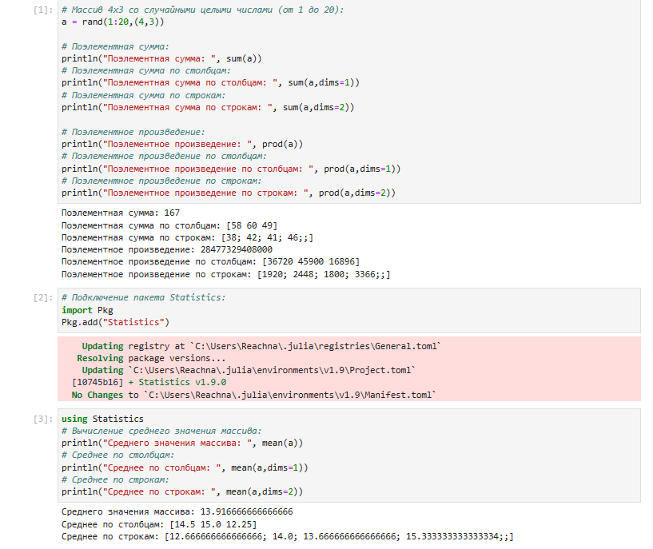
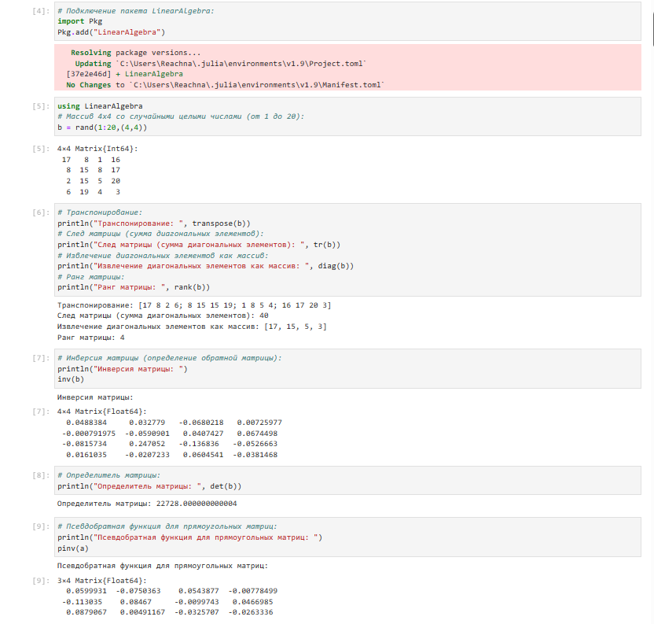
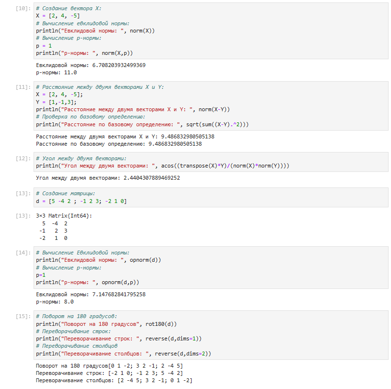
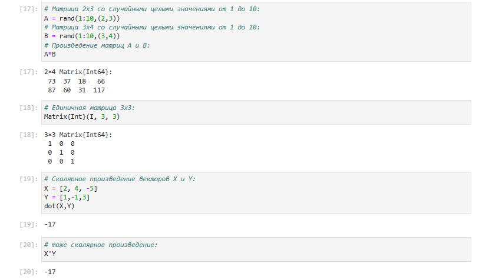
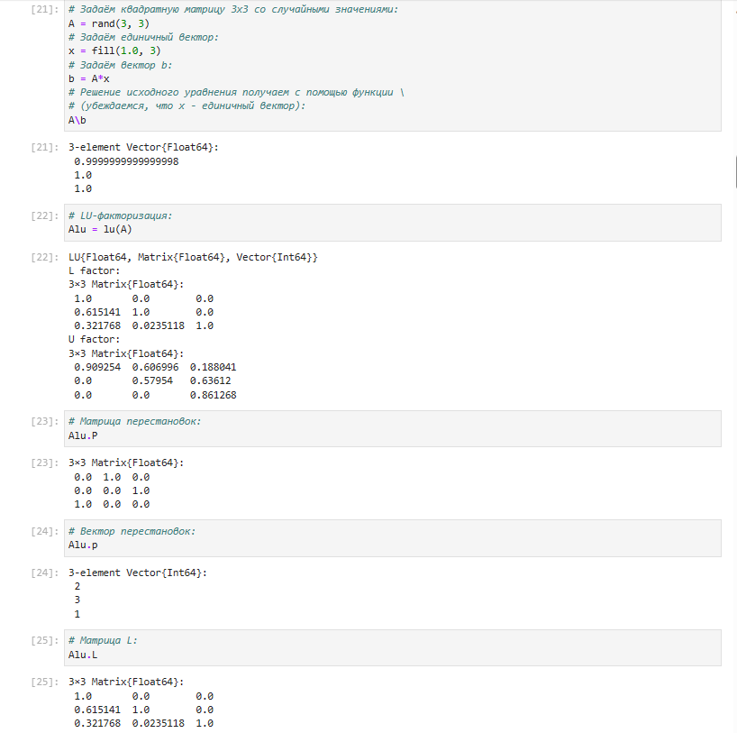
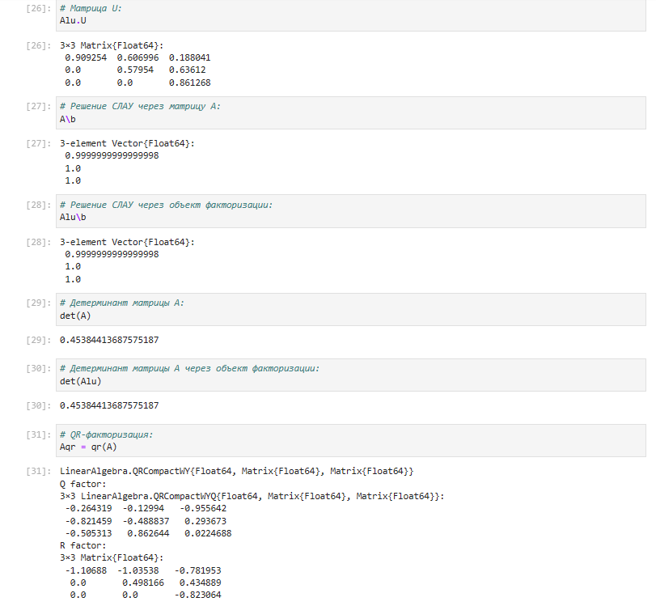
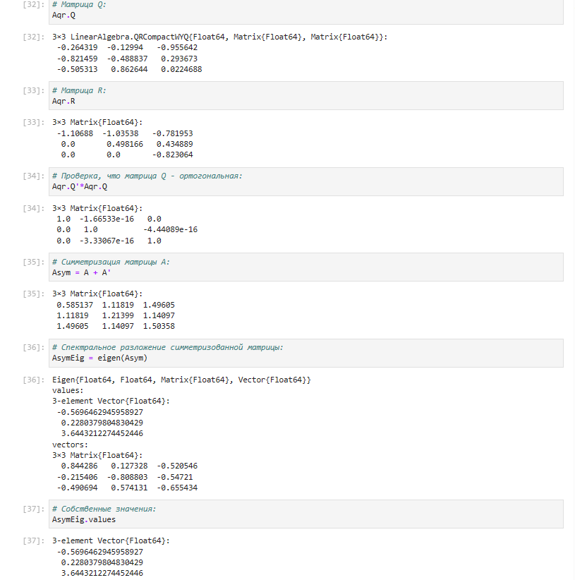
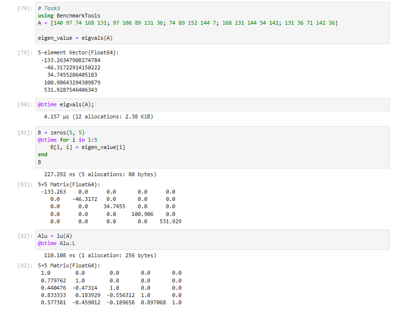

---
## Front matter
lang: ru-RU
title: Лабораторная работа №4
subtitle:  Линейная алгебра
author: |
	 Ким Реачна\inst{1}

institute: |
	\inst{1}Российский Университет Дружбы Народов

date: 28 ноября, 2023, Москва, Россия

## Formatting
mainfont: PT Serif
romanfont: PT Serif
sansfont: PT Sans
monofont: PT Mono
toc: false
slide_level: 2
theme: metropolis
header-includes: 
 - \metroset{progressbar=frametitle,sectionpage=progressbar,numbering=fraction}
 - '\makeatletter'
 - '\beamer@ignorenonframefalse'
 - '\makeatother'
aspectratio: 43
section-titles: true

---
# Цели и задачи

## Цель лабораторной работы

Основной целью работы является изучение возможностей специализированных пакетов Julia для выполнения и оценки эффективности операций над объектами линейной алгебры.

## Задание

1. Используя Jupyter Lab, повторите примеры.
2. Выполните задания для самостоятельной работы.

# Процесс выполнения лабораторной работы

## Поэлементные операции над многомерными массивами

{width=60% height=60%}

##  Транспонирование, след, ранг, определитель и инверсия матрицы

{width=60% height=60%}

## Вычисление нормы векторов и матриц, повороты, вращения

{width=60% height=60%}

## Матричное умножение, единичная матрица, скалярное произведение

{width=60% height=60%}

## Факторизация. Специальные матричные структуры

{width=60% height=60%}

## Факторизация. Специальные матричные структуры

{width=60% height=60%}

## Факторизация. Специальные матричные структуры

{width=60% height=60%}

## Задания для самостоятельного выполнения

{width=70% height=70% }

# Выводы по проделанной работе

## Вывод

Я изучила возможностей специализированных пакетов Julia для выполнения и оценки эффективности операций над объектами линейной алгебры.
