---
## Front matter
lang: ru-RU
title: Лабораторная работа №5
subtitle:  Построение графиков
author: |
	 Ким Реачна\inst{1}

institute: |
	\inst{1}Российский Университет Дружбы Народов

date: 07 декабря, 2023, Москва, Россия

## Formatting
mainfont: PT Serif
romanfont: PT Serif
sansfont: PT Sans
monofont: PT Mono
toc: false
slide_level: 2
theme: metropolis
header-includes: 
 - \metroset{progressbar=frametitle,sectionpage=progressbar,numbering=fraction}
 - '\makeatletter'
 - '\beamer@ignorenonframefalse'
 - '\makeatother'
aspectratio: 43
section-titles: true

---
# Цели и задачи

## Цель лабораторной работы

Основная цель работы — освоить синтаксис языка Julia для построения графиков.

## Задание

1. Используя Jupyter Lab, повторите примеры.
2. Выполните задания для самостоятельной работы.

# Процесс выполнения лабораторной работы

## Основные пакеты для работы с графиками в Julia

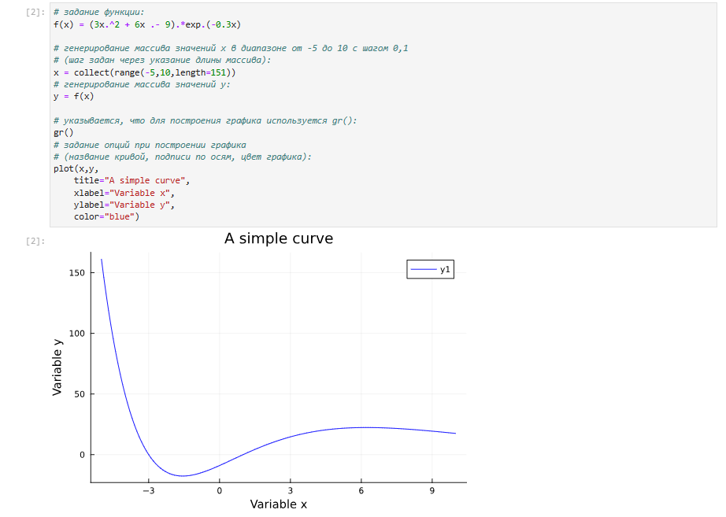{width=70% height=70%}

## Опции при построении графика

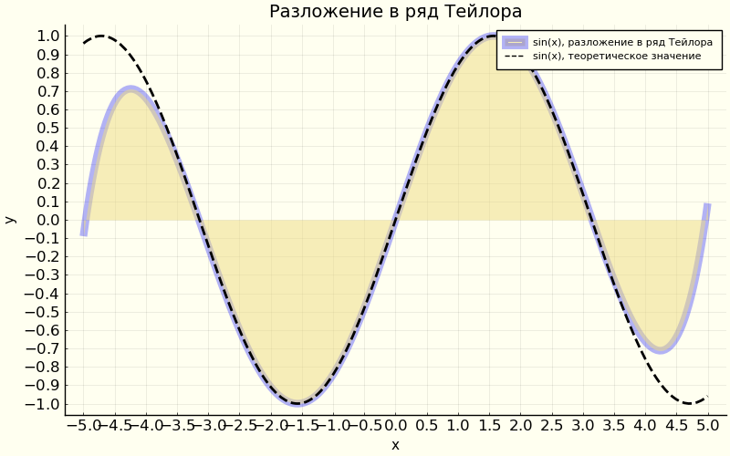{width=70% height=70%}

## Точечный график -  Простой точечный график

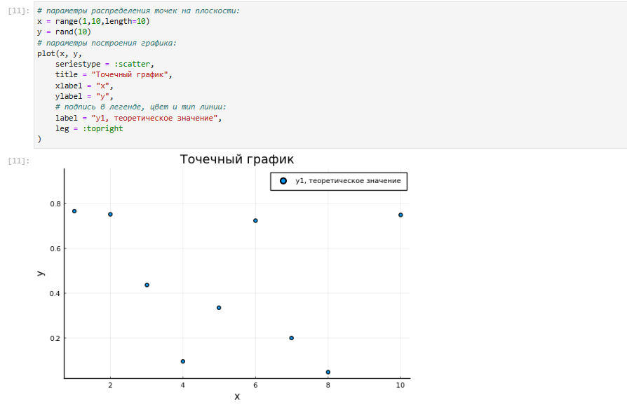{width=70% height=70%}

## Точечный график с кодированием значения размером точки

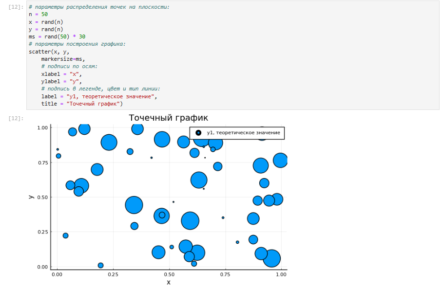{width=70% height=70%}

## 3-мерный точечный график с кодированием значения размером точки

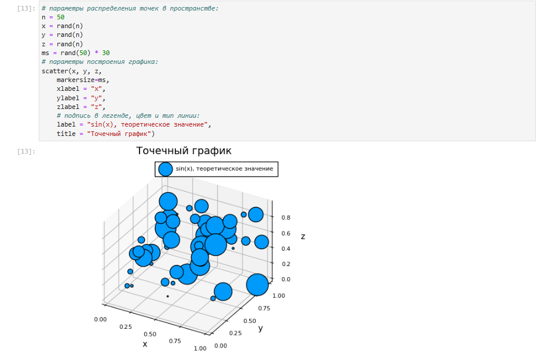{width=70% height=70%}

## Аппроксимация данных

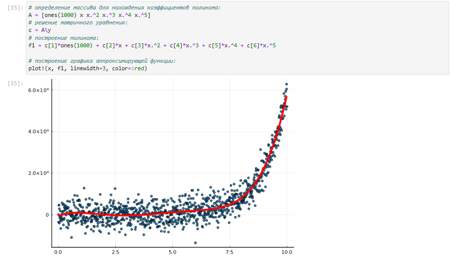{width=70% height=70%}

## Две оси ординат

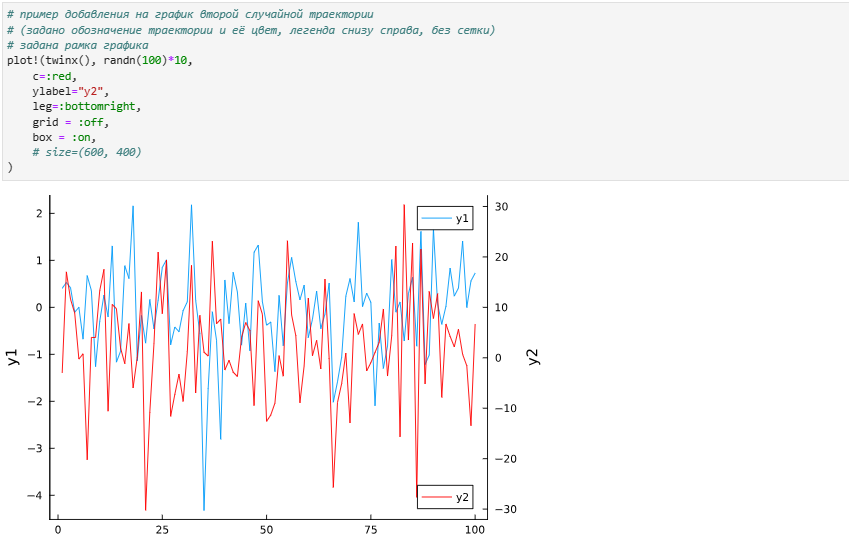{width=70% height=70%}

## Полярные координаты

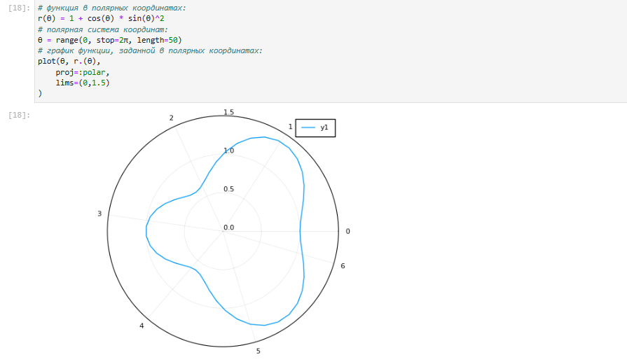{width=70% height=70%}

## Параметрический график кривой на плоскости

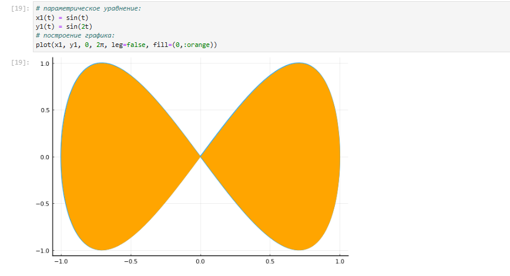{width=70% height=70%}

## Параметрический график кривой в пространстве

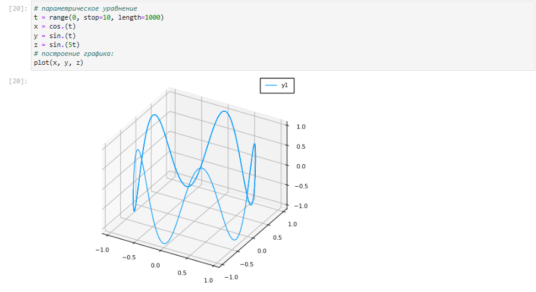{width=70% height=70%}

##  График поверхности

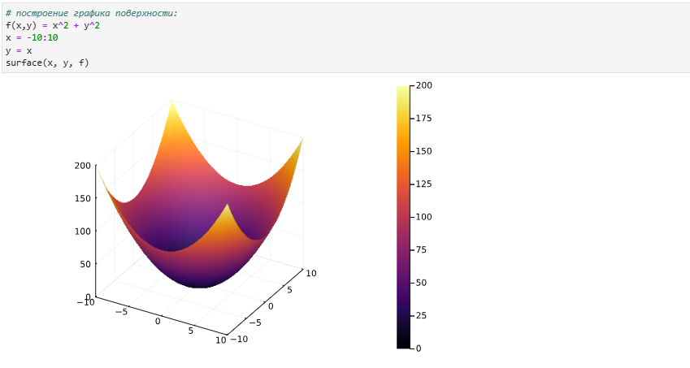{width=70% height=70%}

##  Линии уровня

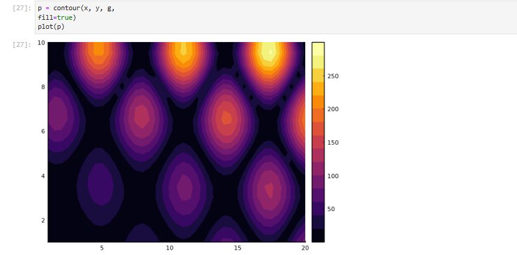{width=70% height=70%}

## Векторные поля

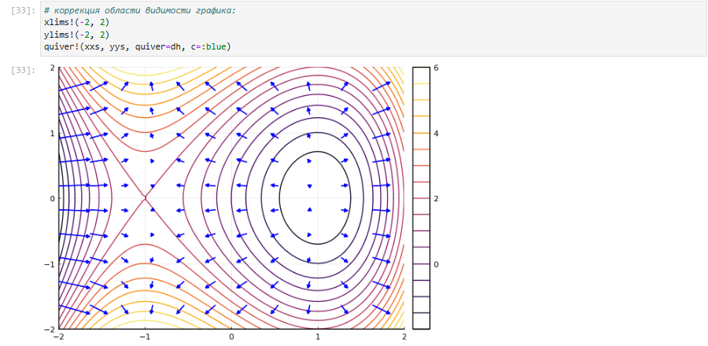{width=70% height=70%}

## Анимация -  Gif-анимация

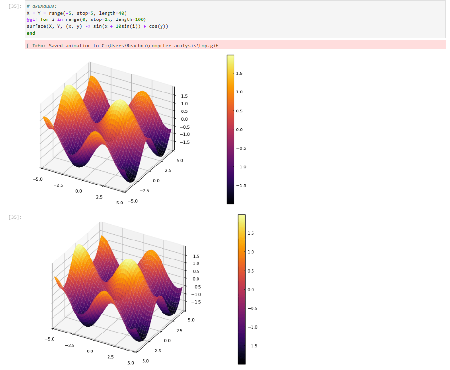{width=70% height=70%}

## Анимация - Гипоциклоида

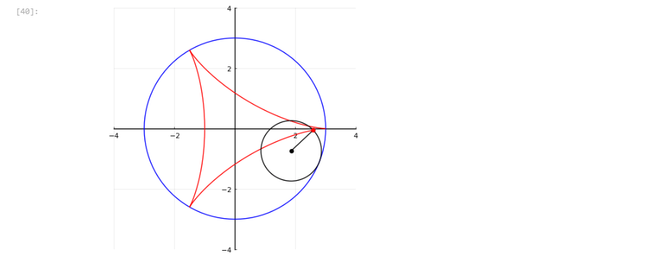{width=70% height=70%}

## Анимация - Синусоида

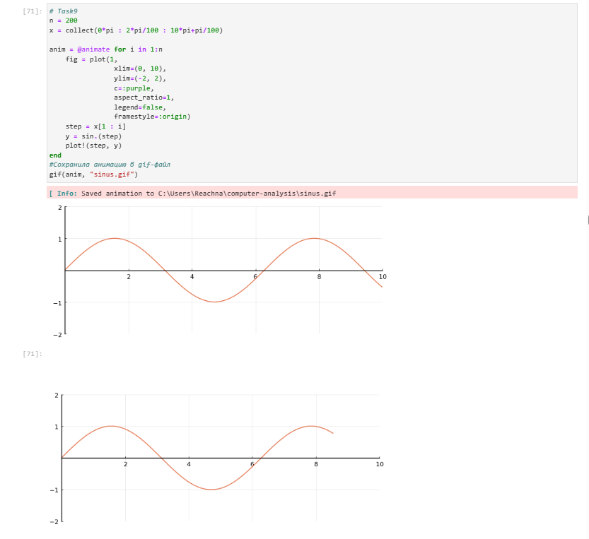{width=80% height=80%}

##  Errorbars

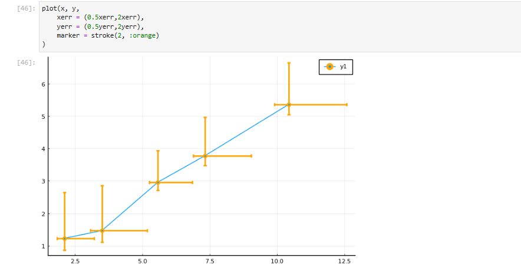{width=70% height=70%}

## Использование пакета Distributions

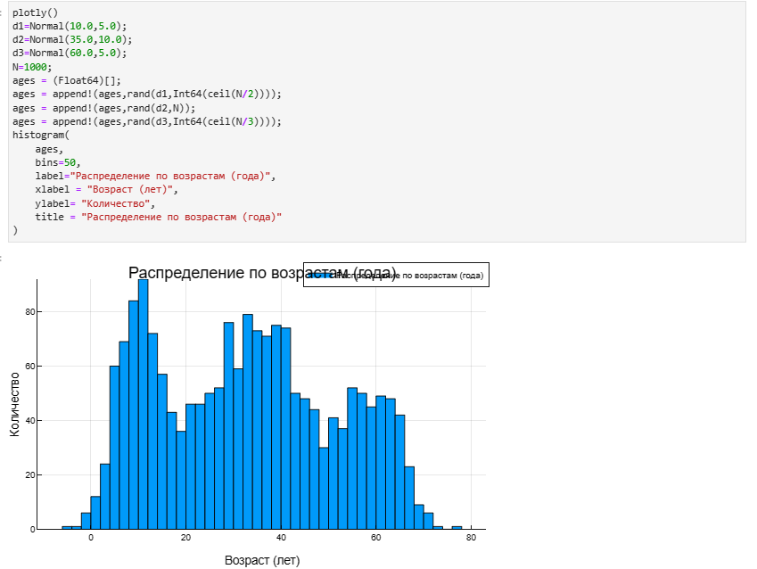{width=70% height=70%}

## Подграфики

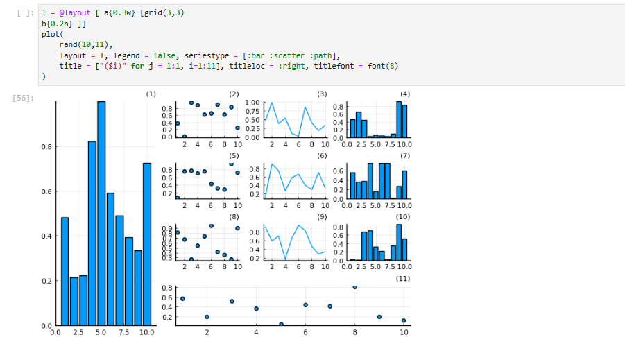{width=70% height=70%}

# Выводы по проделанной работе

## Вывод

Освоила синтаксис языка Julia для построения графиков.
