---
## Front matter
lang: ru-RU
title: Лабораторная работа №7
subtitle:  Введение в работу с данными
author: |
	 Ким Реачна\inst{1}

institute: |
	\inst{1}Российский Университет Дружбы Народов

date: 20 декабря, 2023, Москва, Россия

## Formatting
mainfont: PT Serif
romanfont: PT Serif
sansfont: PT Sans
monofont: PT Mono
toc: false
slide_level: 2
theme: metropolis
header-includes: 
 - \metroset{progressbar=frametitle,sectionpage=progressbar,numbering=fraction}
 - '\makeatletter'
 - '\beamer@ignorenonframefalse'
 - '\makeatother'
aspectratio: 43
section-titles: true

---
# Цели и задачи

## Цель лабораторной работы

Основной целью работы является специализированных пакетов Julia для обработки данных.

## Задание

1. Используя Jupyter Lab, повторите примеры.
2. Выполните задания для самостоятельной работы.

# Процесс выполнения лабораторной работы

##  Считывание данных

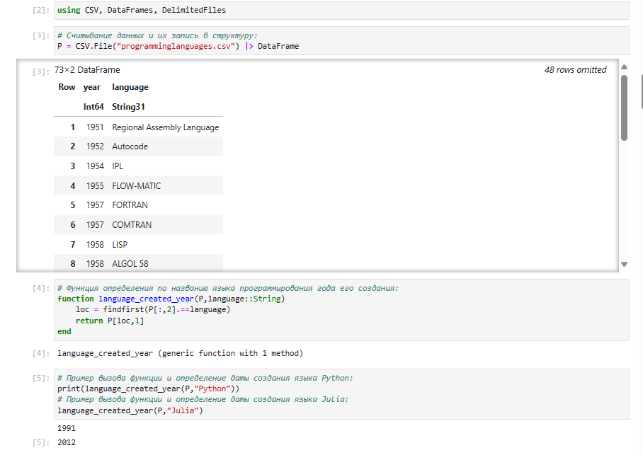{width=80% height=80%}

##  Запись данных в файл

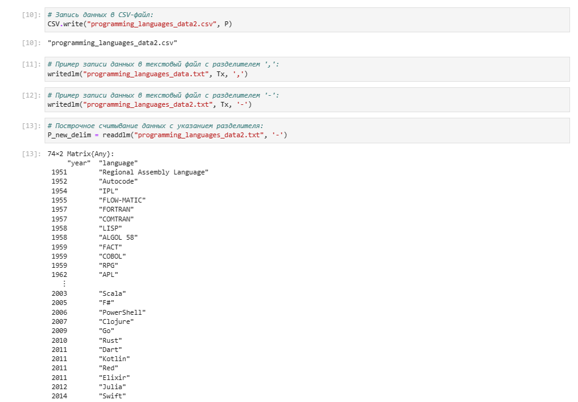{width=80% height=80%}

##  Словари

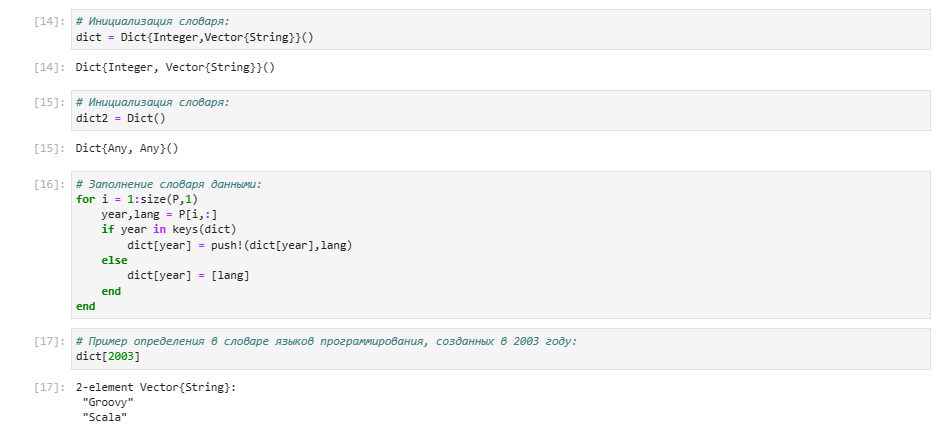{width=80% height=80%}

## DataFrames

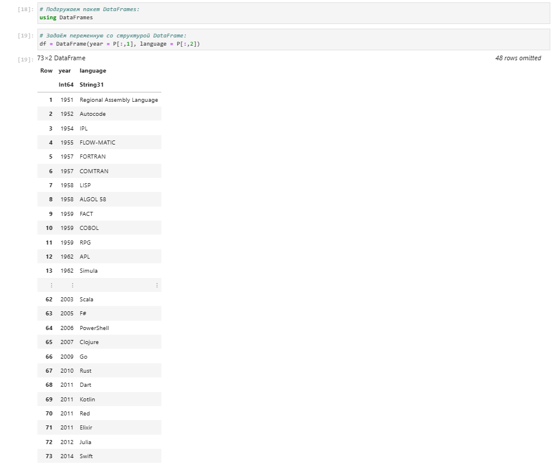{width=80% height=80%}

##  RDatasets

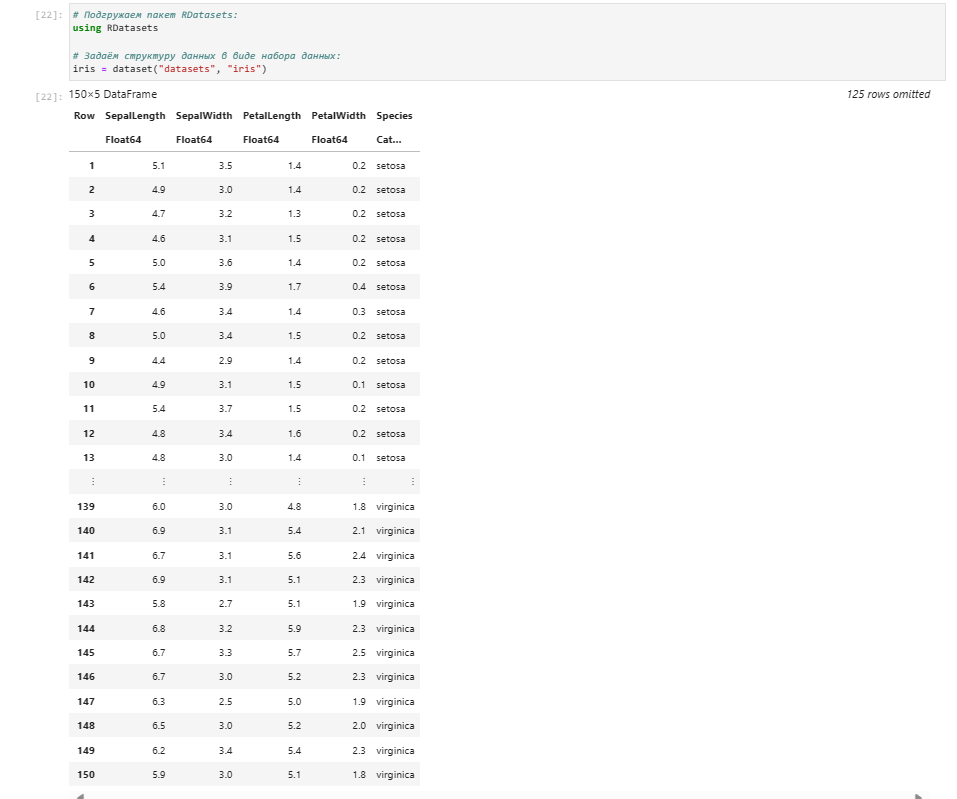{width=80% height=80%}

## Работа с переменными отсутствующего типа (Missing Values)

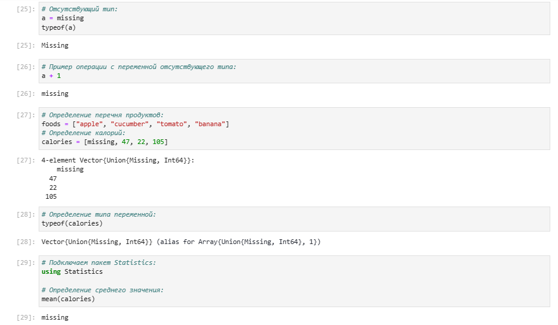{width=80% height=80%}

## FileIO

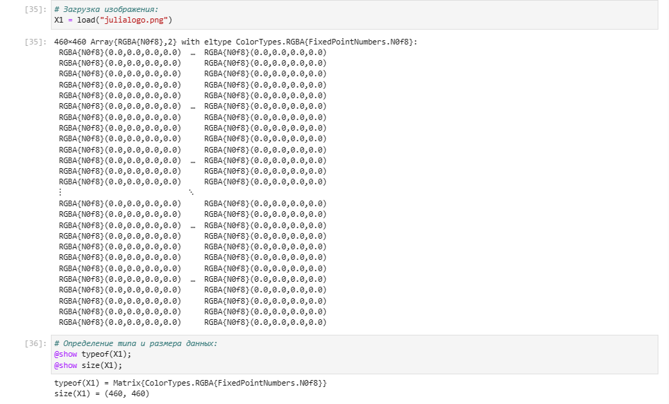{width=80% height=80%}

## Кластеризация данных. Метод k-средних

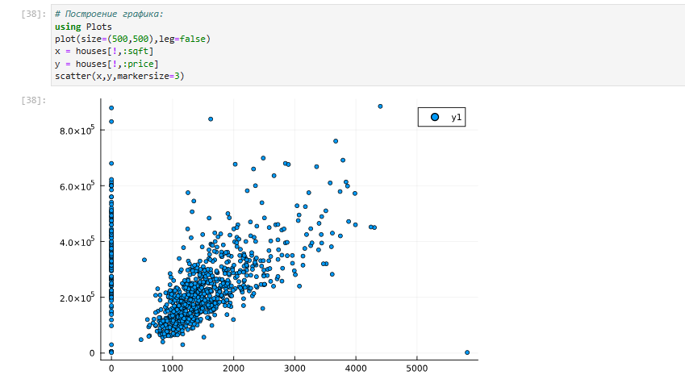{width=80% height=80%}

##  Кластеризация данных. Метод k ближайших соседей

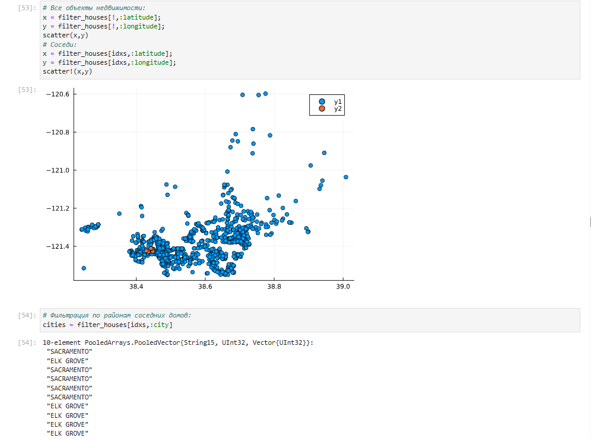{width=80% height=80%}

## Обработка данных. Метод главных компонент

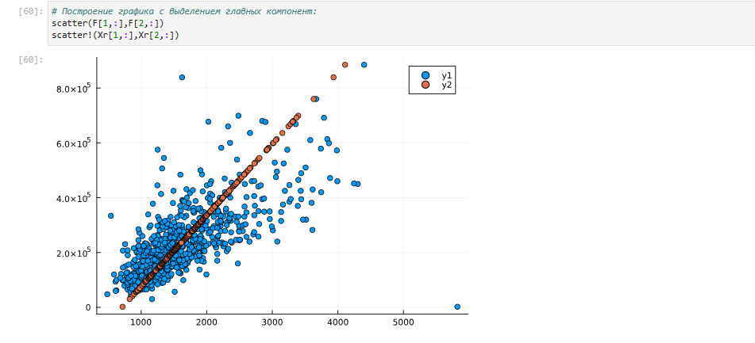{width=80% height=80%}

## Обработка данных. Линейная регрессия

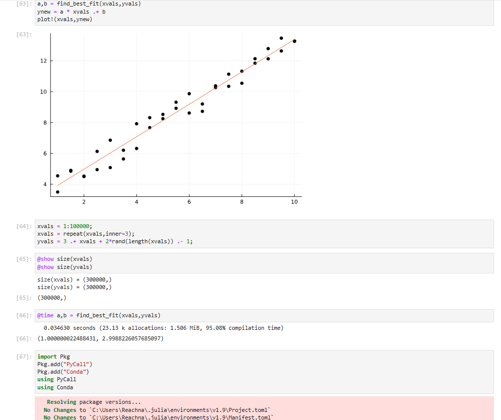{width=80% height=80%}

## Задания для самостоятельного выполнения - Кластеризация

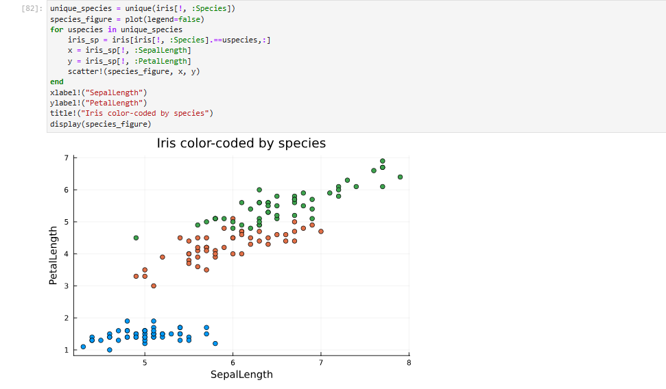{width=80% height=80%}

## Задания для самостоятельного выполнения - Регрессия

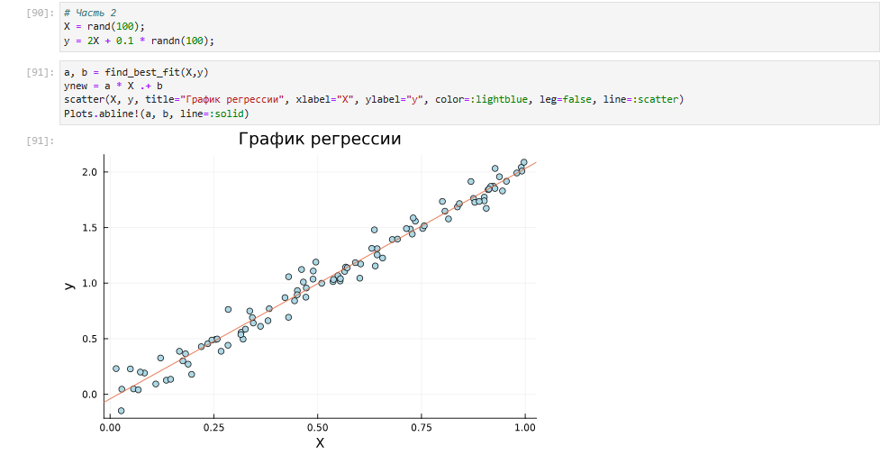{width=80% height=80%}

## Модель ценообразования биномиальных опционов

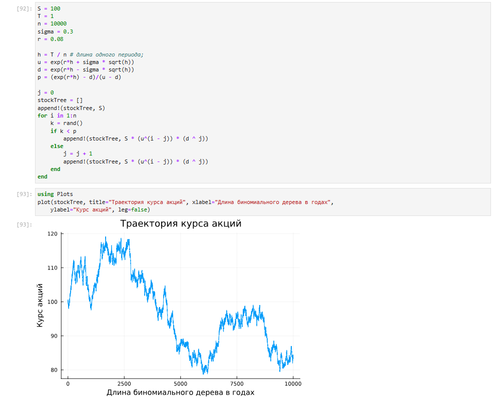{width=80% height=80%}

# Выводы по проделанной работе

## Вывод

Я специализировала пакетов Julia для обработки данных.
