---
## Front matter
lang: ru-RU
title: Лабораторная работа №8
subtitle:  Оптимизация
author: |
	 Ким Реачна\inst{1}

institute: |
	\inst{1}Российский Университет Дружбы Народов

date: 25 декабря, 2023, Москва, Россия

## Formatting
mainfont: PT Serif
romanfont: PT Serif
sansfont: PT Sans
monofont: PT Mono
toc: false
slide_level: 2
theme: metropolis
header-includes: 
 - \metroset{progressbar=frametitle,sectionpage=progressbar,numbering=fraction}
 - '\makeatletter'
 - '\beamer@ignorenonframefalse'
 - '\makeatother'
aspectratio: 43
section-titles: true

---
# Цели и задачи

## Цель лабораторной работы

Основная цель работа — освоить пакеты Julia для решения задач оптимизации.

## Задание

1. Используя Jupyter Lab, повторите примеры.
2. Выполните задания для самостоятельной работы.

# Процесс выполнения лабораторной работы

##  Линейное программирование

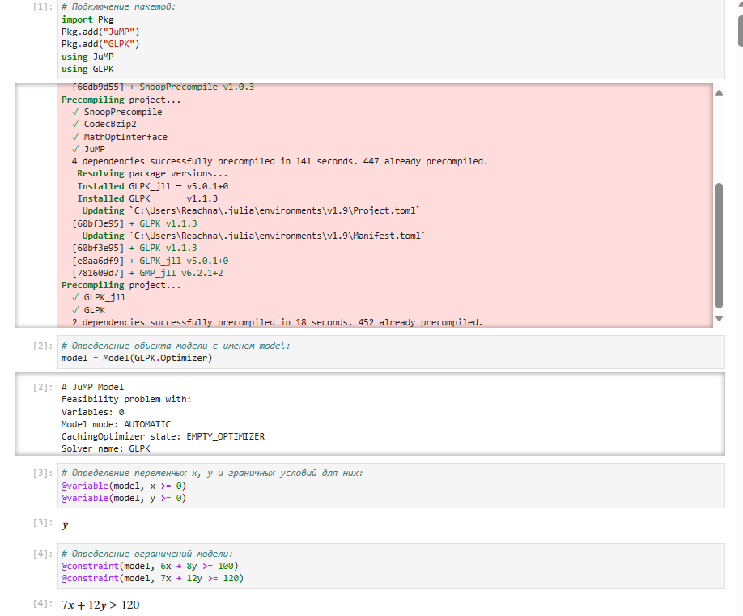{width=70% height=70%}

##  Векторизованные ограничения и целевая функция оптимизации

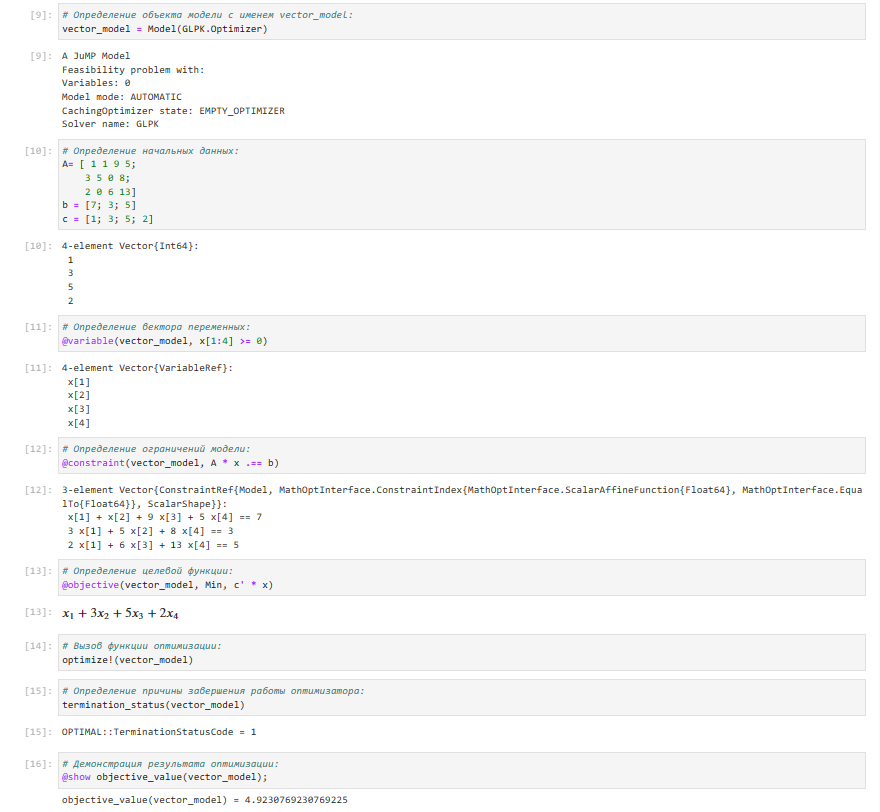{width=70% height=70%}

## Оптимизация рациона питания

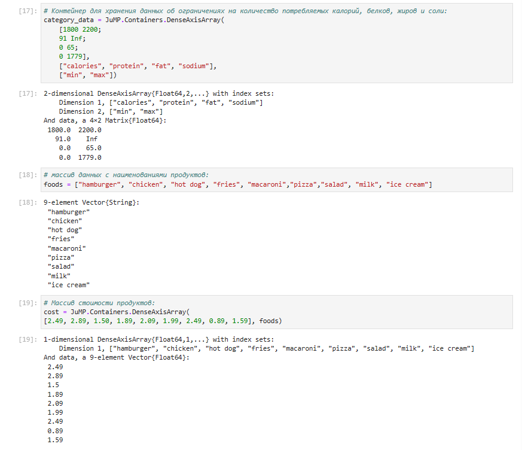{width=70% height=70%}

## Путешествие по миру

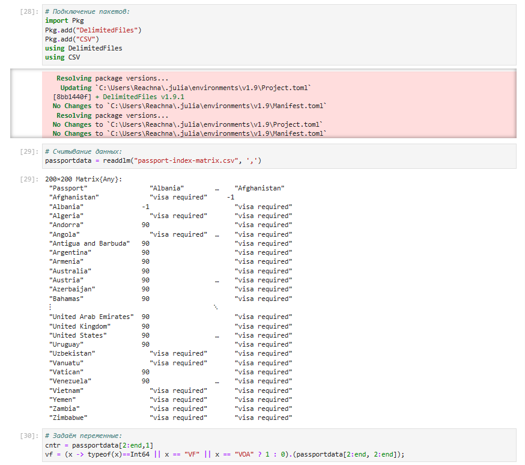{width=70% height=70%}

## Портфельные инвестиции

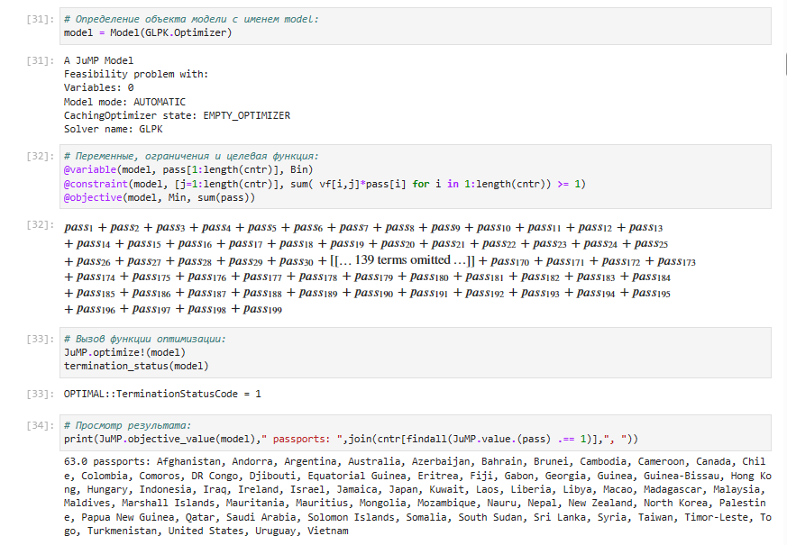{width=70% height=70%}

## Восстановление изображения

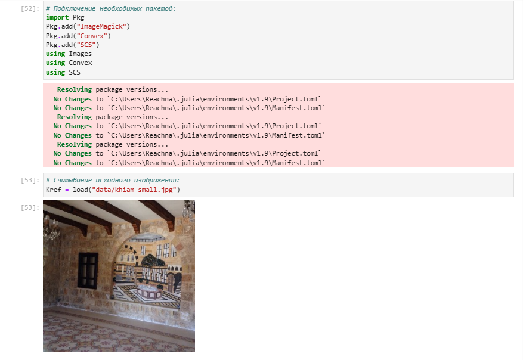{width=70% height=70%}

##  Задания для самостоятельного выполнения - Линейное программирование

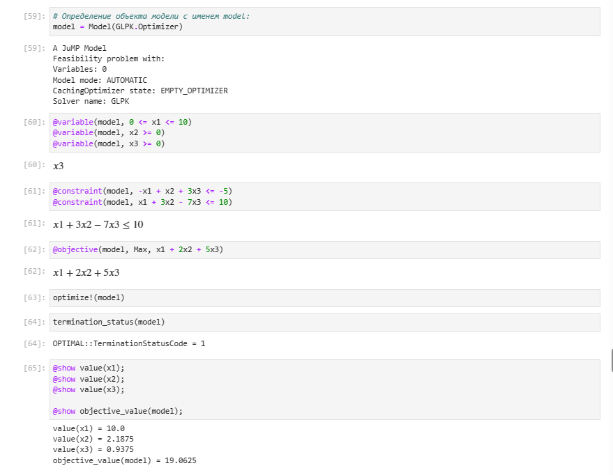{width=70% height=70%}

## Линейное программирование. Использование массивов

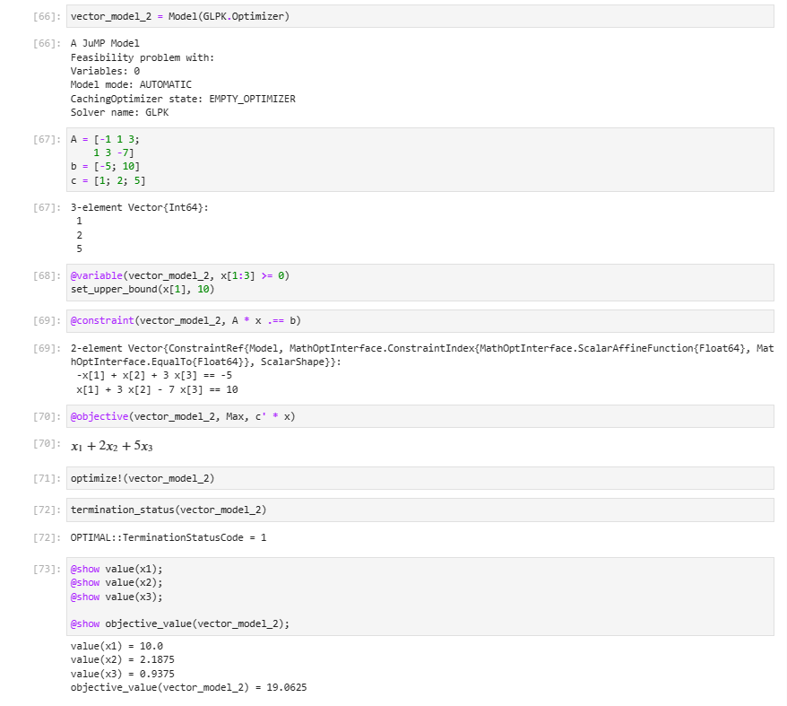{width=70% height=70%}

##  Выпуклое программирование

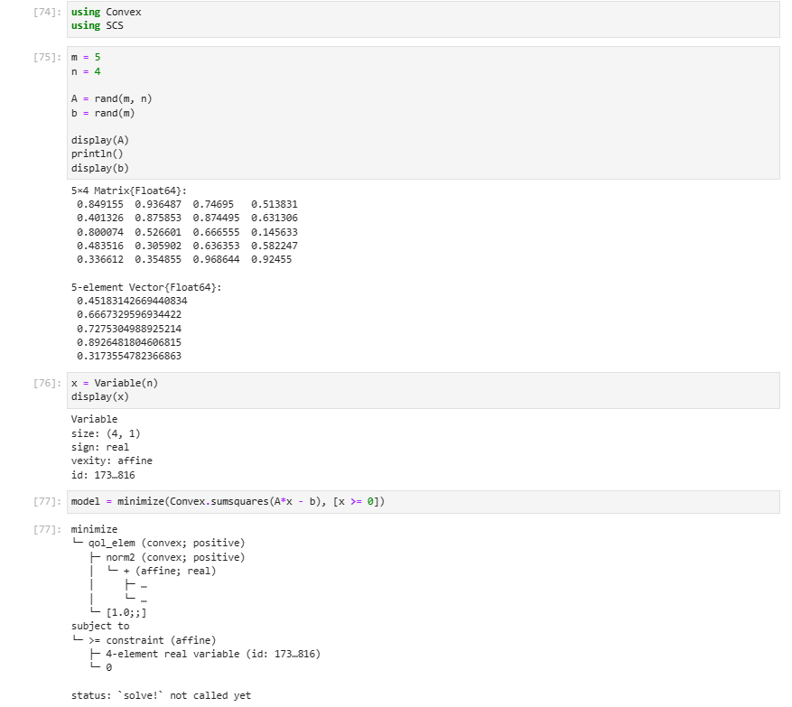{width=70% height=70%}

## Оптимальная рассадка по залам

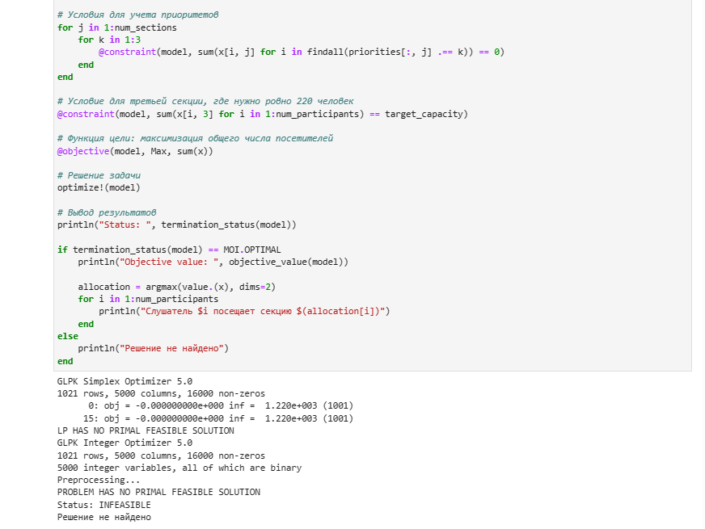{width=70% height=70%}

## План приготовления кофе

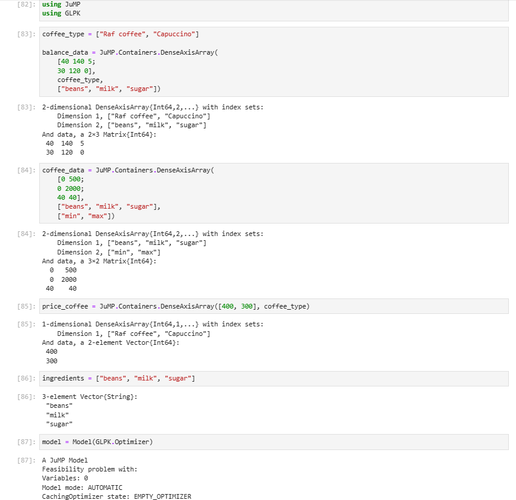{width=70% height=70%}

# Выводы по проделанной работе

## Вывод

Освоила пакеты Julia для решения задач оптимизации.
