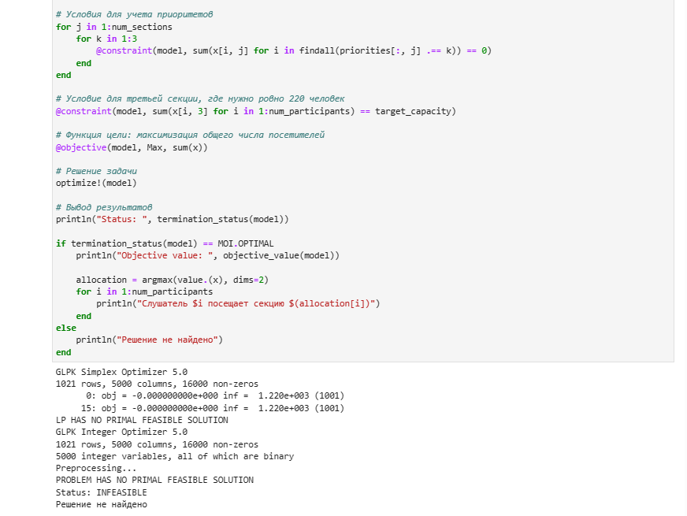

---
## Front matter
title: "Отчёт по лабораторной работе №8"
subtitle: "Оптимизация"
author: "Ким Реачна"

## Generic otions
lang: ru-RU
toc-title: "Содержание"

## Bibliography
bibliography: bib/cite.bib
csl: pandoc/csl/gost-r-7-0-5-2008-numeric.csl

## Pdf output format
toc: true # Table of contents
toc-depth: 2
lof: true # List of figures
fontsize: 12pt
linestretch: 1.5
papersize: a4
documentclass: scrreprt
## I18n polyglossia
polyglossia-lang:
  name: russian
  options:
	- spelling=modern
	- babelshorthands=true
polyglossia-otherlangs:
  name: english
## I18n babel
babel-lang: russian
babel-otherlangs: english
## Fonts
mainfont: PT Serif
romanfont: PT Serif
sansfont: PT Sans
monofont: PT Mono
mainfontoptions: Ligatures=TeX
romanfontoptions: Ligatures=TeX
sansfontoptions: Ligatures=TeX,Scale=MatchLowercase
monofontoptions: Scale=MatchLowercase,Scale=0.9
## Biblatex
biblatex: true
biblio-style: "gost-numeric"
biblatexoptions:
  - parentracker=true
  - backend=biber
  - hyperref=auto
  - language=auto
  - autolang=other*
  - citestyle=gost-numeric
## Pandoc-crossref LaTeX customization
figureTitle: "Рис."
listingTitle: "Листинг"
lofTitle: "Список иллюстраций"
lolTitle: "Листинги"
## Misc options
indent: true
header-includes:
  - \usepackage{indentfirst}
  - \usepackage{float} # keep figures where there are in the text
  - \floatplacement{figure}{H} # keep figures where there are in the text
---

# Цель работы

Основная цель работа — освоить пакеты Julia для решения задач оптимизации.

# Выполнение лабораторной работы

##   Линейное программирование

{width=70% height=70%}

{width=70% height=70%}

##  Векторизованные ограничения и целевая функция оптимизации

{width=70% height=70%}

## Оптимизация рациона питания

{width=70% height=70%}

{width=70% height=70%}

{width=70% height=70%}

{width=70% height=70%}

## Путешествие по миру

{width=70% height=70%}

{width=70% height=70%}

## Портфельные инвестиции

{width=70% height=70%}

{width=70% height=70%}

{width=70% height=70%}

{width=70% height=70%}

{width=70% height=70%}

{width=70% height=70%}

## Восстановление изображения

{width=70% height=70%}

{width=70% height=70%}

{width=70% height=70%}

##  Задания для самостоятельного выполнения

### Линейное программирование

Решите задачу линейного программирования: $x_1+2x_2+5x_3 \rightarrow max$, при заданных ограничениях: $-x_1+x_2+3x_3 \leqslant -5, x_1+3x_2-7x_3  \leqslant 10, 0 \leqslant x_1 \leqslant 10, x_2 \geqslant 0, x_3 \geqslant 0$

Для  начала  определяю  объект  модели  с  именем  model.  Затем  задаю
переменные и граничные условия для них с помощью $@variable$. Далее применяем ограничения модели с помощью $@consatraint. И в @objective$ определяем функцию для нахождения максимума, передаем также модель со всей информацией, переданной до этого. Затем вызываем функцию оптимизации и проверяем причину остановки оптимизатора. Выдан результат OPTIMAL, что означает завершение нахождения оптимального значения для заданной функции:

{width=70% height=70%}

### Линейное программирование. Использование массивов

Решите предыдущее задание, используя массивы вместо скалярных переменных.

{width=70% height=70%}

Результат	совпадает	с	предыдущим	пунктом	–	делаю	вывод,	что оптимизация проведена верно.

###  Выпуклое программирование

Решите задачу оптимизации: $\| A\vec{x} - \vec{b}\|_{2}^{2} \rightarrow min$ при заданных ограничениях: $\vec{x} \succeq 0$: 

{width=70% height=70%}

{width=70% height=70%}

### Оптимальная рассадка по залам

{width=70% height=70%}

{width=70% height=70%}

### План приготовления кофе

Кофейня готовит два вида кофе «Раф кофе» за 400 рублей и «Капучино» за 300. Чтобы сварить 1 чашку «Раф кофе» необходимо: 40 гр. зёрен, 140 гр. молока и 5 гр. ванильного сахара. Для того чтобы получить одну чашку «Капучино» необходимо потратить: 30 гр. зёрен, 120 гр. молока. На складе есть: 500 гр. зёрен, 2000 гр. молока и 40 гр. ванильного сахара.

{width=70% height=70%}

{width=70% height=70%}

# Листинги  программы

```julia
# Подключение пакетов:
import Pkg
Pkg.add("JuMP")
Pkg.add("GLPK")
using JuMP
using GLPK
# Определение объекта модели с именем model:
model = Model(GLPK.Optimizer)
A JuMP Model
Feasibility problem with:
Variables: 0
Model mode: AUTOMATIC
CachingOptimizer state: EMPTY_OPTIMIZER
Solver name: GLPK
# Определение переменных x, y и граничных условий для них:
@variable(model, x >= 0)
@variable(model, y >= 0)
# Определение ограничений модели:
@constraint(model, 6x + 8y >= 100)
@constraint(model, 7x + 12y >= 120)
# Определение целевой функции:
@objective(model, Min, 12x + 20y)
# Вызов функции оптимизации:
optimize!(model)
# Определение причины завершения работы оптимизатора:
termination_status(model)
OPTIMAL::TerminationStatusCode = 1
# Демонстрация первичных результирующих значений переменных x и y:
@show value(x);
@show value(y);
# Демонстрация результата оптимизации:
@show objective_value(model);
# Демонстрация первичных результирующих значений переменных x и y:
@show value(x);
@show value(y);
# Демонстрация результата оптимизации:
@show objective_value(model);
value(x) = 14.999999999999993
value(y) = 1.2500000000000047
objective_value(model) = 205.0
## Векторизованные ограничения и целевая функция оптимизации
# Подключение пакетов:
import Pkg
Pkg.add("JuMP")
Pkg.add("GLPK")
using JuMP
using GLPK
   Resolving package versions...
  No Changes to `C:\Users\Reachna\.julia\environments\v1.9\Project.toml`
  No Changes to `C:\Users\Reachna\.julia\environments\v1.9\Manifest.toml`
   Resolving package versions...
  No Changes to `C:\Users\Reachna\.julia\environments\v1.9\Project.toml`
  No Changes to `C:\Users\Reachna\.julia\environments\v1.9\Manifest.toml`
# Определение объекта модели с именем vector_model:
vector_model = Model(GLPK.Optimizer)
A JuMP Model
Feasibility problem with:
Variables: 0
Model mode: AUTOMATIC
CachingOptimizer state: EMPTY_OPTIMIZER
Solver name: GLPK
# Определение начальных данных:
A= [ 1 1 9 5;
    3 5 0 8;
    2 0 6 13]
b = [7; 3; 5]
c = [1; 3; 5; 2]
4-element Vector{Int64}:
 1
 3
 5
 2
# Определение вектора переменных:
@variable(vector_model, x[1:4] >= 0)
4-element Vector{VariableRef}:
 x[1]
 x[2]
 x[3]
 x[4]
# Определение ограничений модели:
@constraint(vector_model, A * x .== b)
# Определение целевой функции:
@objective(vector_model, Min, c' * x)
# Вызов функции оптимизации:
optimize!(vector_model)
# Определение причины завершения работы оптимизатора:
termination_status(vector_model)
OPTIMAL::TerminationStatusCode = 1
# Демонстрация результата оптимизации:
@show objective_value(vector_model);
objective_value(vector_model) = 4.9230769230769225
Оптимизация рациона питания
# Подключение пакетов:
import Pkg
Pkg.add("JuMP")
Pkg.add("GLPK")
using JuMP
using GLPK
# Контейнер для хранения данных об ограничениях на количество 
# потребляемых калорий, белков, жиров и соли:
category_data = JuMP.Containers.DenseAxisArray(
    [1800 2200;
    91 Inf;
    0 65;
    0 1779],
    ["calories", "protein", "fat", "sodium"],
    ["min", "max"])
2-dimensional DenseAxisArray{Float64,2,...} with index sets:
    Dimension 1, ["calories", "protein", "fat", "sodium"]
    Dimension 2, ["min", "max"]
And data, a 4×2 Matrix{Float64}:
 1800.0  2200.0
   91.0    Inf
    0.0    65.0
    0.0  1779.0
# массив данных с наименованиями продуктов:
foods = ["hamburger", "chicken", "hot dog", "fries", "macaroni", 
"pizza","salad", "milk", "ice cream"]
9-element Vector{String}:
 "hamburger"
 "chicken"
 "hot dog"
 "fries"
 "macaroni"
 "pizza"
 "salad"
 "milk"
 "ice cream"
# Массив стоимости продуктов:
cost = JuMP.Containers.DenseAxisArray(
    [2.49, 2.89, 1.50, 1.89, 2.09, 1.99, 2.49, 0.89, 1.59],foods)
1-dimensional DenseAxisArray{Float64,1,...} with index sets:
    Dimension 1, ["hamburger", "chicken", "hot dog", "fries", 
    "macaroni", "pizza", "salad", "milk", "ice cream"]
And data, a 9-element Vector{Float64}:
 2.49
 2.89
 1.5
 1.89
 2.09
 1.99
 2.49
 0.89
 1.59
# Массив данных о содержании калорий, белков, жиров и соли в продуктах питания:
food_data = JuMP.Containers.DenseAxisArray(
    [410 24 26 730;
    420 32 10 1190;
    560 20 32 1800;
    380 4 19 270;
    320 12 10 930;
    320 15 12 820;
    320 31 12 1230;
    100 8 2.5 125;
    330 8 10 180],
    foods,
    ["calories", "protein", "fat", "sodium"])
2-dimensional DenseAxisArray{Float64,2,...} with index sets:
    Dimension 1, ["hamburger", "chicken", "hot dog", "fries", 
    "macaroni", "pizza", "salad", "milk", "ice cream"]
    Dimension 2, ["calories", "protein", "fat", "sodium"]
And data, a 9×4 Matrix{Float64}:
 410.0  24.0  26.0   730.0
 420.0  32.0  10.0  1190.0
 560.0  20.0  32.0  1800.0
 380.0   4.0  19.0   270.0
 320.0  12.0  10.0   930.0
 320.0  15.0  12.0   820.0
 320.0  31.0  12.0  1230.0
 100.0   8.0   2.5   125.0
 330.0   8.0  10.0   180.0
# Определение объекта модели с именем model:
model = Model(GLPK.Optimizer)
A JuMP Model
Feasibility problem with:
Variables: 0
Model mode: AUTOMATIC
CachingOptimizer state: EMPTY_OPTIMIZER
Solver name: GLPK
# Определим массив:
categories = ["calories", "protein", "fat", "sodium"]
4-element Vector{String}:
 "calories"
 "protein"
 "fat"
 "sodium"
# Определение переменных:
@variables(model, begin
    category_data[c, "min"] <= nutrition[c = categories] <= category_data[c, "max"]
    # Сколько покупать продуктов:
    buy[foods] >= 0
end)
(1-dimensional DenseAxisArray{VariableRef,1,...} with index sets:
    Dimension 1, ["calories", "protein", "fat", "sodium"]
And data, a 4-element Vector{VariableRef}:
 nutrition[calories]
 nutrition[protein]
 nutrition[fat]
And data, a 9-element Vector{VariableRef}:
 buy[hamburger]
 buy[chicken]
 buy[hot dog]
 buy[fries]
 buy[macaroni]
 buy[pizza]
 buy[salad]
 buy[milk]
 buy[ice cream])
# Определение целевой функции:
@objective(model, Min, sum(cost[f] * buy[f] for f in foods))
# Определение ограничений модели:
@constraint(model, [c in categories], sum(food_data[f, c] * buy[f] for f in foods) == nutrition[c])
# Вызов функции оптимизации:
JuMP.optimize!(model)
term_status = JuMP.termination_status(model)
OPTIMAL::TerminationStatusCode = 1
hcat(buy.data,JuMP.value.(buy.data))
9×2 Matrix{AffExpr}:
 buy[hamburger]  0.6045138888888888
 buy[chicken]    0
 buy[hot dog]    0
 buy[fries]      0
 buy[macaroni]   0
 buy[pizza]      0
 buy[salad]      0
 buy[milk]       6.9701388888888935
 buy[ice cream]  2.591319444444441
9×2 Matrix{AffExpr}:
 buy[hamburger]  0.6045138888888888
 buy[chicken]    0
 buy[hot dog]    0
 buy[fries]      0
 buy[macaroni]   0
 buy[pizza]      0
 buy[salad]      0
 buy[milk]       6.9701388888888935
 buy[ice cream]  2.591319444444441
# Подключение пакетов:
import Pkg
Pkg.add("DelimitedFiles")
Pkg.add("CSV")
using DelimitedFiles
using CSV
# Считывание данных:
passportdata = readdlm("passport-index-matrix.csv",',')
200×200 Matrix{Any}:
 "Passport"                "Albania"        .    "Afghanistan"
 "Afghanistan"             "visa required"     -1
 "Albania"               -1                      "visa required"
 "Algeria"                 "visa required"       "visa required"
 "Andorra"               90                      "visa required"
 "Angola"                  "visa required"  .    "visa required"
 "Antigua and Barbuda"   90                      "visa required"
 "Argentina"             90                      "visa required"
 "Armenia"               90                      "visa required"
 "Australia"             90                      "visa required"
 "Austria"               90                 .    "visa required"
 "Azerbaijan"            90                      "visa required"
 "Bahamas"               90                      "visa required"
 .                                          .  
 "United Arab Emirates"  90                      "visa required"
 "United Kingdom"        90                      "visa required"
 "United States"         90                 .    "visa required"
 "Uruguay"               90                      "visa required"
 "Uzbekistan"              "visa required"       "visa required"
 "Vanuatu"                 "visa required"       "visa required"
 "Vatican"               90                      "visa required"
 "Venezuela"             90                 .    "visa required"
 "Vietnam"                 "visa required"       "visa required"
 "Yemen"                   "visa required"       "visa required"
 "Zambia"                  "visa required"       "visa required"
 "Zimbabwe"                "visa required"       "visa required"
# Задаём переменные:
cntr = passportdata[2:end,1]
vf = (x -> typeof(x)==Int64 || x == "VF" || x == "VOA" ? 1 : 0).(passportdata[2:end,2:end]);
# Определение объекта модели с именем model:
model = Model(GLPK.Optimizer)
A JuMP Model
Feasibility problem with:
Variables: 0
Model mode: AUTOMATIC
CachingOptimizer state: EMPTY_OPTIMIZER
Solver name: GLPK
# Переменные, ограничения и целевая функция:
@variable(model, pass[1:length(cntr)], Bin)
@constraint(model, [j=1:length(cntr)], sum( vf[i,j]*pass[i] for i in 1:length(cntr)) >= 1)
@objective(model, Min, sum(pass))
# Вызов функции оптимизации:
JuMP.optimize!(model)
termination_status(model)
OPTIMAL::TerminationStatusCode = 1
# Просмотр результата:
print(JuMP.objective_value(model)," passports: ",join(cntr[findall(JuMP.value.(pass) .== 1)],", "))
# Подключение необходимых пакетов:
import Pkg
Pkg.add("DataFrames")
Pkg.add("XLSX")
Pkg.add("Plots")
Pkg.add("PyPlot")
Pkg.add("Convex")
Pkg.add("SCS")
Pkg.add("Statistics")
using DataFrames
using XLSX
using Plots
pyplot()
using Convex
using SCS
using Statistics
# Считываем данные и размещаем их во фрейм:
T = DataFrame(XLSX.readtable("data/stock_prices.xlsx","Sheet2"))
# Построение графика:
plot(T[!,:MSFT],label="Microsoft")
plot!(T[!,:AAPL],label="Apple")
plot!(T[!,:FB],label="FB")
# Данные о ценах на акции размещаем в матрице:
prices_matrix = Matrix(T)
# Данные о ценах на акции размещаем в матрице:
prices_matrix = Matrix(T)
13×3 Matrix{Any}:
 101.93  137.95  148.26
 102.8   143.8   152.29
 107.71  150.04  156.82
 107.17  149.01  157.76
 102.78  165.71  166.52
 105.67  167.33  170.41
 108.22  162.5   170.42
 110.97  161.89  172.97
 112.53  162.28  174.97
 110.51  169.6   172.91
 115.91  165.98  186.12
 117.05  164.34  191.05
 117.94  166.69  189.95
# Вычисление матрицы доходности за период времени:
M1 = prices_matrix[1:end-1,:]
M2 = prices_matrix[2:end,:]
# Матрица доходности:
R = (M2.-M1)./M1
12×3 Matrix{Float64}:
  0.00853527   0.0424067    0.027182
  0.0477626    0.0433936    0.0297459
 -0.00501346  -0.00686484   0.00599413
 -0.040963     0.112073     0.0555274
  0.0281183    0.00977611   0.0233606
  0.0241317   -0.0288651    5.8682e-5
  0.0254112   -0.00375385   0.014963
  0.0140579    0.00240904   0.0115627
 -0.0179508    0.0451072   -0.0117734
  0.0488644   -0.0213443    0.0763981
  0.00983522  -0.00988071   0.0264883
  0.00760359   0.0142996   -0.00575766
# Матрица рисков:
risk_matrix = cov(R)
# Проверка положительной определённости матрицы рисков:
isposdef(risk_matrix)
true
# Доход от каждой из компаний:
r = mean(R,dims=1)[:]
3-element Vector{Float64}:
 0.012532748705136572
 0.016563036855293173
 0.02114580465503291
# Вектор инвестиций:
x = Variable(length(r))
Variable
size: (3, 1)
sign: real
vexity: affine
id: 121…312
# Объект модели:
problem = minimize(Convex.quadform(x,risk_matrix),[sum(x)==1;r'*x>=0.02;x.>=0])
minimize
└─ * (convex; positive)
   ├─ 1
   └─ qol_elem (convex; positive)
      ├─ norm2 (convex; positive)
      │  └─ …
      └─ [1.0;;]
subject to
├─ == constraint (affine)
│  ├─ sum (affine; real)
│  │  └─ 3-element real variable (id: 121…312)
│  └─ 1
├─ >= constraint (affine)
│  ├─ * (affine; real)
│  │  ├─ [0.0125327 0.016563 0.0211458]
│  │  └─ 3-element real variable (id: 121…312)
│  └─ 0.02
├─ >= constraint (affine)
│  ├─ index (affine; real)
│  │  └─ 3-element real variable (id: 121…312)
│  └─ 0
├─ >= constraint (affine)
│  ├─ index (affine; real)
│  │  └─ 3-element real variable (id: 121…312)
│  └─ 0
└─ >= constraint (affine)
   ├─ index (affine; real)
   │  └─ 3-element real variable (id: 121…312)
   └─ 0
status: `solve!` not called yet
# Находим решение:
solve!(problem, SCS.Optimizer)
------------------------------------------------------------------
	       SCS v3.2.4 - Splitting Conic Solver
	(c) Brendan O'Donoghue, Stanford University, 2012
------------------------------------------------------------------
problem:  variables n: 6, constraints m: 14
cones: 	  z: primal zero / dual free vars: 2
	  l: linear vars: 5
	  q: soc vars: 7, qsize: 2
settings: eps_abs: 1.0e-004, eps_rel: 1.0e-004, eps_infeas: 1.0e-007
	  alpha: 1.50, scale: 1.00e-001, adaptive_scale: 1
	  max_iters: 100000, normalize: 1, rho_x: 1.00e-006
	  acceleration_lookback: 10, acceleration_interval: 10
lin-sys:  sparse-direct-amd-qdldl
	  nnz(A): 24, nnz(P): 0
------------------------------------------------------------------
 iter | pri res | dua res |   gap   |   obj   |  scale  | time (s)
------------------------------------------------------------------
     0|1.71e+001 1.00e+000 1.62e+001 -8.03e+000 1.00e-001 2.46e-003 
    75|8.16e-005 1.46e-004 5.60e-005 5.56e-004 1.00e-001 2.51e-003 
------------------------------------------------------------------
status:  solved
timings: total: 2.51e-003s = setup: 2.42e-003s + solve: 9.60e-005s
	 lin-sys: 2.39e-005s, cones: 1.58e-005s, accel: 4.80e-006s
------------------------------------------------------------------
objective = 0.000556
------------------------------------------------------------------
sum(x.value)
0.9999994443731297
r'*x.value
1×1 adjoint(::Vector{Float64}) with eltype Float64:
 0.02001195936160116
x.value .* 1000
3×1 Matrix{Float64}:
  69.22834751660402
 117.301582202275
 813.4695146542507
# Подключение необходимых пакетов:
import Pkg
Pkg.add("ImageMagick")
Pkg.add("Convex")
Pkg.add("SCS")
using Images
using Convex
using SCS
# Считывание исходного изображения:
Kref = load("data/khiam-small.jpg")
K = copy(Kref)
p = prod(size(K))
missingids = rand(1:p,400)
K[missingids] .= RGBX{N0f8}(0.0,0.0,0.0)
K
Gray.(K)
# Матрица цветов:
Y = Float64.(Gray.(K));
correctids = findall(Y[:].!=0)
X = Convex.Variable(size(Y))
problem = minimize(nuclearnorm(X))
problem.constraints += X[correctids]==Y[correctids]
# Находим решение:
solve!(problem, SCS.Optimizer())
@show norm(float.(Gray.(Kref))-X.value)
@show norm(-X.value)
colorview(Gray, X.value)
## Линейное программирование
# Определение объекта модели с именем model:
model = Model(GLPK.Optimizer)
A JuMP Model
Feasibility problem with:
Variables: 0
Model mode: AUTOMATIC
CachingOptimizer state: EMPTY_OPTIMIZER
Solver name: GLPK
@variable(model, 0 <= x1 <= 10)
@variable(model, x2 >= 0)
@variable(model, x3 >= 0)
@constraint(model, -x1 + x2 + 3x3 <= -5)
@constraint(model, x1 + 3x2 - 7x3 <= 10)
@objective(model, Max, x1 + 2x2 + 5x3)
optimize!(model)
termination_status(model)
OPTIMAL::TerminationStatusCode = 1
@show value(x1);
@show value(x2);
@show value(x3);
​
@show objective_value(model);
value(x1) = 10.0
value(x2) = 2.1875
value(x3) = 0.9375
objective_value(model) = 19.0625
Линейное программирование. Использование массивов
vector_model_2 = Model(GLPK.Optimizer)
A JuMP Model
Feasibility problem with:
Variables: 0
Model mode: AUTOMATIC
CachingOptimizer state: EMPTY_OPTIMIZER
Solver name: GLPK
A = [-1 1 3;
    1 3 -7]
b = [-5; 10]
c = [1; 2; 5]
3-element Vector{Int64}:
 1
 2
 5
@variable(vector_model_2, x[1:3] >= 0)
set_upper_bound(x[1], 10)
@constraint(vector_model_2, A * x .== b)
@objective(vector_model_2, Max, c' * x) 
optimize!(vector_model_2)
termination_status(vector_model_2)
OPTIMAL::TerminationStatusCode = 1
@show value(x1);
@show value(x2);
@show value(x3);
@show objective_value(vector_model_2);
value(x1) = 10.0
value(x2) = 2.1875
value(x3) = 0.9375
objective_value(vector_model_2) = 19.0625
Выпуклое программирование
using Convex
using SCS
m = 5
n = 4
A = rand(m, n)
b = rand(m)
display(A)
println()
display(b)
x = Variable(n)
display(x)
Variable
size: (4, 1)
sign: real
vexity: affine
id: 173…816
model = minimize(Convex.sumsquares(A*x - b), [x >= 0])
minimize
└─ qol_elem (convex; positive)
   ├─ norm2 (convex; positive)
   │  └─ + (affine; real)
   │     ├─ …
   │     └─ …
   └─ [1.0;;]
subject to
└─ >= constraint (affine)
   ├─ 4-element real variable (id: 173…816)
   └─ 0

status: `solve!` not called yet
solve!(model, SCS.Optimizer)
------------------------------------------------------------------
	       SCS v3.2.4 - Splitting Conic Solver
	(c) Brendan O'Donoghue, Stanford University, 2012
------------------------------------------------------------------
problem:  variables n: 7, constraints m: 15
cones: 	  z: primal zero / dual free vars: 1
	  l: linear vars: 5
	  q: soc vars: 9, qsize: 2
settings: eps_abs: 1.0e-004, eps_rel: 1.0e-004, eps_infeas: 1.0e-007
	  alpha: 1.50, scale: 1.00e-001, adaptive_scale: 1
	  max_iters: 100000, normalize: 1, rho_x: 1.00e-006
	  acceleration_lookback: 10, acceleration_interval: 10
lin-sys:  sparse-direct-amd-qdldl
	  nnz(A): 30, nnz(P): 0
------------------------------------------------------------------
 iter | pri res | dua res |   gap   |   obj   |  scale  | time (s)
------------------------------------------------------------------
     0|1.71e+001 1.00e+000 1.62e+001 -8.04e+000 1.00e-001 7.85e-005 
   125|4.22e-007 3.39e-007 1.28e-006 3.04e-001 7.57e-001 1.63e-004 
------------------------------------------------------------------
status:  solved
timings: total: 1.64e-004s = setup: 6.40e-005s + solve: 9.98e-005s
	 lin-sys: 3.49e-005s, cones: 1.40e-005s, accel: 7.20e-006s
------------------------------------------------------------------
objective = 0.304356
------------------------------------------------------------------
model.status
OPTIMAL::TerminationStatusCode = 1
model.optval
0.30435506756440117
Оптимальная рассадка по залам
using JuMP
using GLPK
# Заданные параметры
num_sections = 5
num_rooms = 5
min_capacity = 180
max_capacity = 250
target_capacity = 220
num_participants = 1000
# Генерация случайных приоритетов для слушателей
using Random
Random.seed!(42)
priorities = rand(1:3, num_participants, num_sections)
# Создание модели оптимизации
model = Model(optimizer_with_attributes(GLPK.Optimizer, 
"msg_lev" => GLPK.GLP_MSG_ALL))
​
# Переменные решения: x[i, j] = 1, если слушатель i посещает секцию j
@variable(model, x[1:num_participants, 1:num_sections], Bin)
​
# Условия для вместимости залов
room_capacities = [200, 210, 220, 230, 240]  # Пример вместимости залов
for j in 1:num_rooms
    @constraint(model, sum(x[i, j] for i in 1:num_participants) <= room_capacities[j])
end
​
# Условие, чтобы у каждого слушателя была одна и только одна 
for i in 1:num_participants
    @constraint(model, sum(x[i, :]) == 1)
end
​
# Условия для учета приоритетов
for j in 1:num_sections
    for k in 1:3
        @constraint(model, sum(x[i, j] for i in findall(priorities[:, j] .== k)) == 0)
    end
end
​
# Условие для третьей секции, где нужно ровно 220 человек
@constraint(model, sum(x[i, 3] for i in 1:num_participants) == target_capacity)
​
# Функция цели: максимизация общего числа посетителей
@objective(model, Max, sum(x))
​
# Решение задачи
optimize!(model)
​
# Вывод результатов
println("Status: ", termination_status(model))
​
if termination_status(model) == MOI.OPTIMAL
    println("Objective value: ", objective_value(model))
​
    allocation = argmax(value.(x), dims=2)
    for i in 1:num_participants
        println("Слушатель $i посещает секцию $(allocation[i])")
    end
else
    println("Решение не найдено")
end
GLPK Simplex Optimizer 5.0
1021 rows, 5000 columns, 16000 non-zeros
      0: obj = -0.000000000e+000 inf =  1.220e+003 (1001)
     15: obj = -0.000000000e+000 inf =  1.220e+003 (1001)
LP HAS NO PRIMAL FEASIBLE SOLUTION
GLPK Integer Optimizer 5.0
1021 rows, 5000 columns, 16000 non-zeros
5000 integer variables, all of which are binary
Preprocessing...
PROBLEM HAS NO PRIMAL FEASIBLE SOLUTION
Status: INFEASIBLE
Решение не найдено
План приготовления кофе
using JuMP
using GLPK
coffee_type = ["Raf coffee", "Capuccino"]
balance_data = JuMP.Containers.DenseAxisArray(
    [40 140 5;
    30 120 0],
    coffee_type,
    ["beans", "milk", "sugar"])
2-dimensional DenseAxisArray{Int64,2,...} with index sets:
    Dimension 1, ["Raf coffee", "Capuccino"]
    Dimension 2, ["beans", "milk", "sugar"]
And data, a 2×3 Matrix{Int64}:
 40  140  5
 30  120  0
coffee_data = JuMP.Containers.DenseAxisArray(
    [0 500;
    0 2000;
    40 40],
    ["beans", "milk", "sugar"],
    ["min", "max"])
2-dimensional DenseAxisArray{Int64,2,...} with index sets:
    Dimension 1, ["beans", "milk", "sugar"]
    Dimension 2, ["min", "max"]
And data, a 3×2 Matrix{Int64}:
  0   500
  0  2000
 40    40
price_coffee = JuMP.Containers.DenseAxisArray([400, 300], coffee_type)
1-dimensional DenseAxisArray{Int64,1,...} with index sets:
    Dimension 1, ["Raf coffee", "Capuccino"]
And data, a 2-element Vector{Int64}:
 400
 300
ingredients = ["beans", "milk", "sugar"]
3-element Vector{String}:
 "beans"
 "milk"
 "sugar"
model = Model(GLPK.Optimizer)
A JuMP Model
Feasibility problem with:
Variables: 0
Model mode: AUTOMATIC
CachingOptimizer state: EMPTY_OPTIMIZER
Solver name: GLPK
# Определение переменных:
@variables(model, 
    begin coffee_data[i, "min"] <= nutrition[i = ingredients] 
    <= coffee_data[i, "max"]
        # Сколько использовать продуктов:
        use[coffee_type] >= 0
    end)
(1-dimensional DenseAxisArray{VariableRef,1,...} with index sets:
    Dimension 1, ["beans", "milk", "sugar"]
And data, a 3-element Vector{VariableRef}:
 nutrition[beans]
 nutrition[milk]
 nutrition[sugar], 1-dimensional DenseAxisArray{VariableRef,1,...} with index sets:
    Dimension 1, ["Raf coffee", "Capuccino"]
And data, a 2-element Vector{VariableRef}:
 use[Raf coffee]
 use[Capuccino])
# Определение целевой функции:
@objective(model, Max, sum(price_coffee[c] * use[c] for c in coffee_type))
# Определение ограничений модели:
@constraint(model, [i in ingredients],
    sum(balance_data[c, i] * use[c] for c in coffee_type) == nutrition[i])
# Вызов функции оптимизации:
JuMP.optimize!(model)
term_status = JuMP.termination_status(model)
OPTIMAL::TerminationStatusCode = 1
hcat(use.data,JuMP.value.(use.data))
2×2 Matrix{AffExpr}:
 use[Raf coffee]  8
 use[Capuccino]   6
```

# Вывод

Освоила пакеты Julia для решения задач оптимизации.
